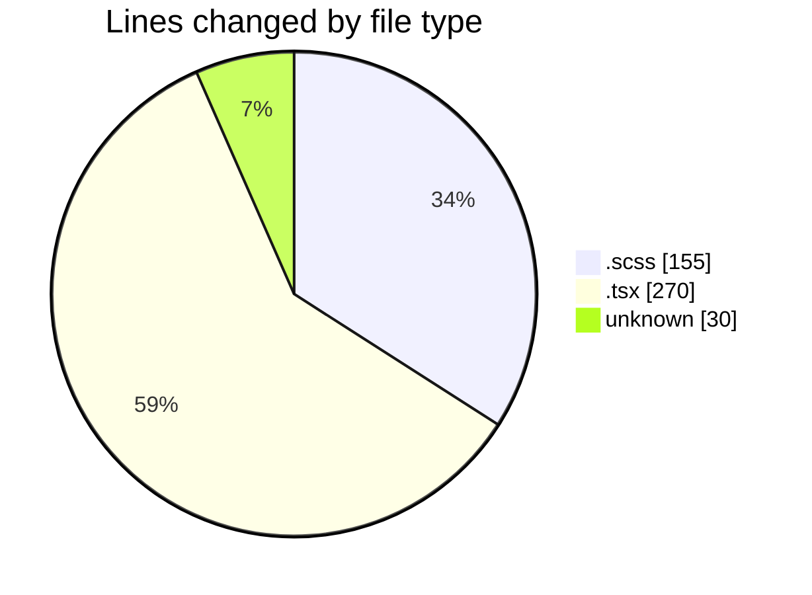

# cda - Activity Summary 

## Overall Statistics

| Stat                   | Value                                                             |
| ---------------------- | ----------------------------------------------------------------- |
| **Lines Added** (➕)   | 426                                          |
| **Lines Removed** (➖) | 29                                        |
| **Net Change** (↕)    | 397                |
| **Active Time** (⌚)   | 18 minutes |

## Modified Files
- **RequestHeader.scss** (+66, -26)
- **UserProvider.tsx** (+41, -0)
- **.env** (+30, -0)
- **App.tsx** (+50, -0)
- **RequestView.scss** (+60, -3)
- **RequestView.tsx** (+179, -0)

## Visualizations

### By File Type (Lines Changed)

### By Hour (Estimated Activity Count)

> **Last Updated:** 05/03/2025, 09:44:24