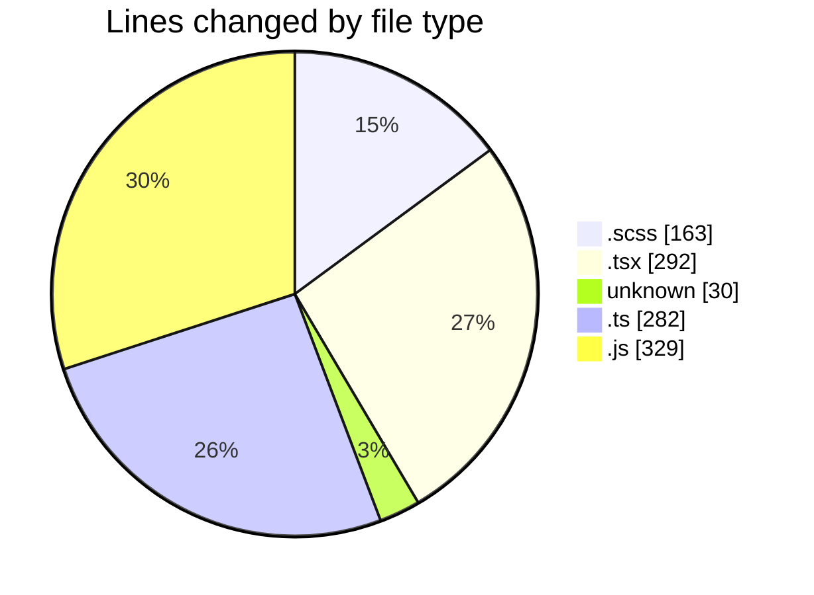
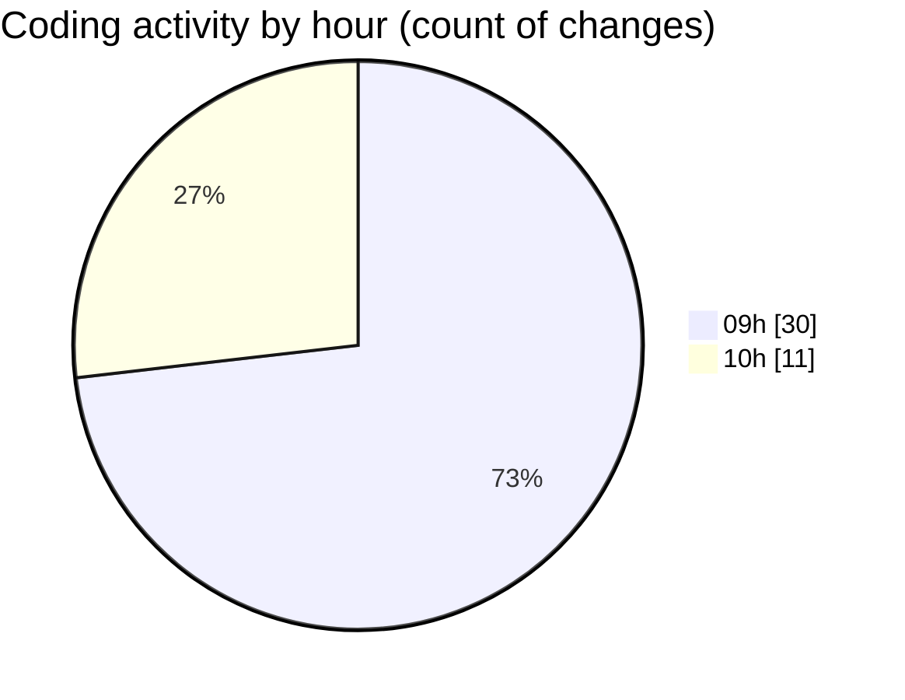

# cda - Activity Summary 

## Overall Statistics

| Stat                   | Value                                                             |
| ---------------------- | ----------------------------------------------------------------- |
| **Lines Added** (➕)   | 964                                          |
| **Lines Removed** (➖) | 132                                        |
| **Net Change** (↕)    | 832                |
| **Active Time** (⌚)   | 50 minutes |

## Modified Files
- **RequestHeader.scss** (+66, -26)
- **UserProvider.tsx** (+42, -0)
- **.env** (+30, -0)
- **App.tsx** (+59, -12)
- **RequestView.scss** (+62, -9)
- **RequestView.tsx** (+179, -0)
- **index.ts** (+3, -0)
- **queries.ts** (+68, -12)
- **types.ts** (+26, -0)
- **dutyRequest.js** (+192, -73)
- **createDutyRequest.ts** (+76, -0)
- **duty-request.js** (+64, -0)
- **updateDutyRequest.ts** (+97, -0)

## Visualizations

### By File Type (Lines Changed)

### By Hour (Estimated Activity Count)

> **Last Updated:** 05/03/2025, 10:39:24