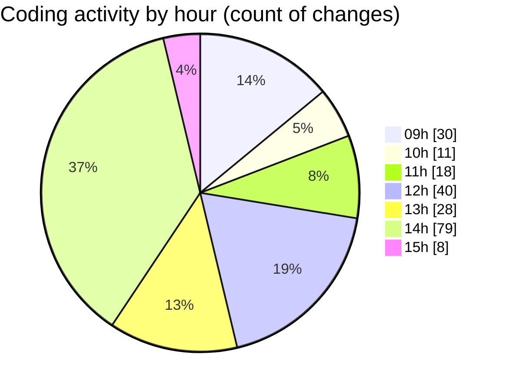

# cda - Activity Summary 

## Overall Statistics

| Stat                   | Value                                                             |
| ---------------------- | ----------------------------------------------------------------- |
| **Lines Added** (➕)   | 3165                                          |
| **Lines Removed** (➖) | 811                                        |
| **Net Change** (↕)    | 2354                |
| **Active Time** (⌚)   | 318 minutes |

## Modified Files
- **RequestHeader.scss** (+87, -68)
- **UserProvider.tsx** (+42, -0)
- **.env** (+30, -0)
- **App.tsx** (+73, -14)
- **RequestView.scss** (+160, -62)
- **RequestView.tsx** (+798, -428)
- **index.ts** (+3, -0)
- **queries.ts** (+68, -12)
- **types.ts** (+32, -0)
- **dutyRequest.js** (+263, -144)
- **createDutyRequest.ts** (+76, -0)
- **duty-request.js** (+88, -24)
- **updateDutyRequest.ts** (+97, -0)
- **AssetEntry.jsx** (+175, -0)
- **index.js** (+211, -0)
- **FlatAssetList.jsx** (+145, -0)
- **StatusUpdateModal.tsx** (+67, -0)
- **index.ts** (+3, -0)
- **RequestView.scss** (+53, -47)
- **RequestView.test.tsx** (+224, -7)
- **RequestHeader.tsx** (+97, -0)
- **Admin.tsx** (+151, -0)
- **RequestHeader.test.tsx** (+82, -1)
- **settings.json** (+73, -0)
- **FilterTab.tsx** (+43, -1)
- **FilterTab.scss** (+24, -3)

## Visualizations

### By File Type (Lines Changed)

### By Hour (Estimated Activity Count)

> **Last Updated:** 05/03/2025, 15:26:16