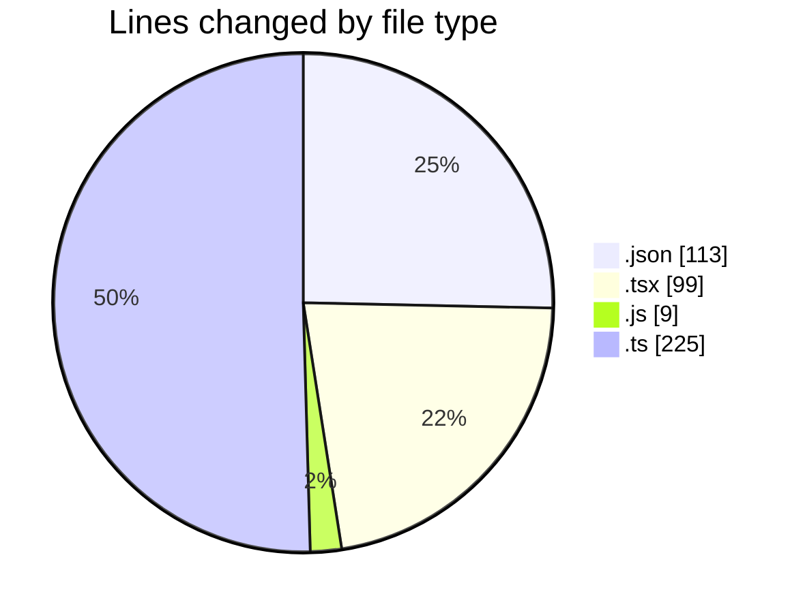
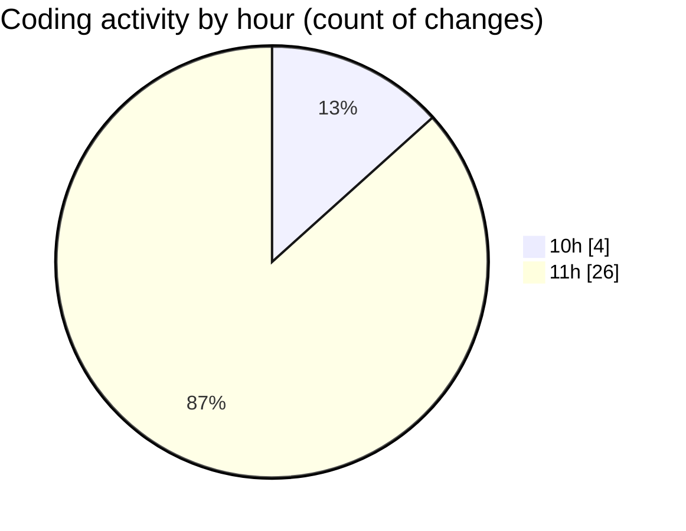

# song-sieve - Activity Summary 

## Overall Statistics

| Stat                   | Value                                                             |
| ---------------------- | ----------------------------------------------------------------- |
| **Lines Added** (➕)   | 414                                          |
| **Lines Removed** (➖) | 32                                        |
| **Net Change** (↕)    | 382                |
| **Active Time** (⌚)   | 27 minutes |

## Modified Files
- **package.json** (+40, -0)
- **page.tsx** (+56, -32)
- **jest.config.js** (+7, -0)
- **jest.setup.js** (+2, -0)
- **Header.test.tsx** (+11, -0)
- **atoms.ts** (+225, -0)
- **settings.json** (+73, -0)

## Visualizations

### By File Type (Lines Changed)

### By Hour (Estimated Activity Count)

> **Last Updated:** 06/03/2025, 11:23:28