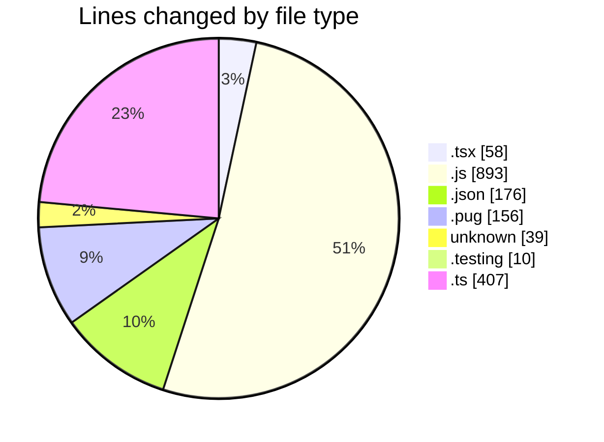
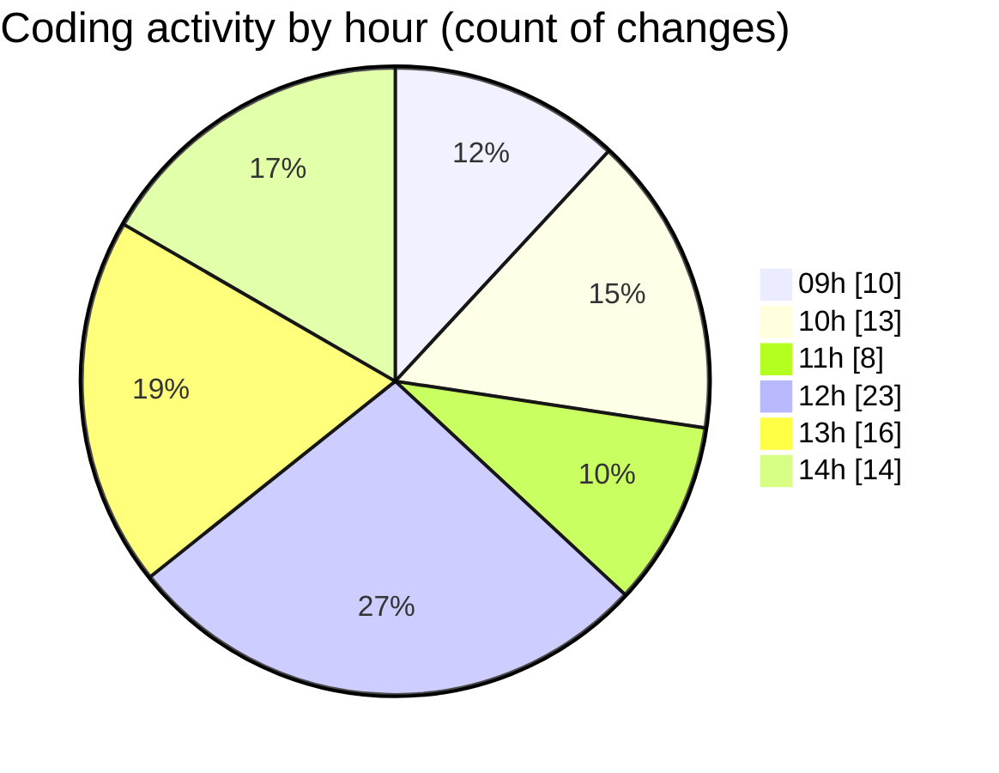

# cda - Activity Summary 

## Overall Statistics

| Stat                   | Value                                                             |
| ---------------------- | ----------------------------------------------------------------- |
| **Lines Added** (➕)   | 1624                                          |
| **Lines Removed** (➖) | 115                                        |
| **Net Change** (↕)    | 1509                |
| **Active Time** (⌚)   | 130 minutes |

## Modified Files
- **App.tsx** (+58, -0)
- **dutyRequest.js** (+496, -92)
- **duty-request.js** (+187, -1)
- **duty-request.json** (+34, -1)
- **html.pug** (+146, -10)
- **.env** (+39, -0)
- **.env.testing** (+10, -0)
- **20250307121920-alter-duty-request-status-history-table.js** (+17, -4)
- **duty-request.js** (+96, -0)
- **package.json** (+64, -0)
- **settings.json** (+75, -2)
- **getDutyRequests.ts** (+118, -4)
- **updateDutyRequest.ts** (+150, -0)
- **createDutyRequest.ts** (+134, -1)

## Visualizations

### By File Type (Lines Changed)

### By Hour (Estimated Activity Count)

> **Last Updated:** 07/03/2025, 14:52:16