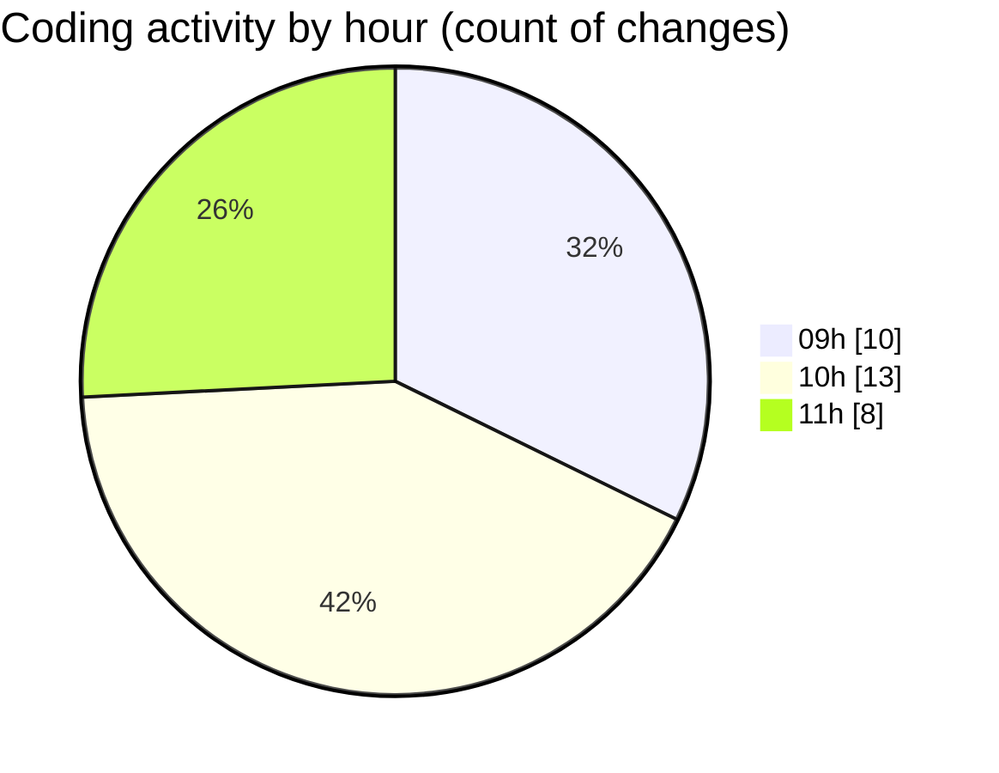

# cda - Activity Summary 

## Overall Statistics

| Stat                   | Value                                                             |
| ---------------------- | ----------------------------------------------------------------- |
| **Lines Added** (➕)   | 774                                          |
| **Lines Removed** (➖) | 26                                        |
| **Net Change** (↕)    | 748                |
| **Active Time** (⌚)   | 43 minutes |

## Modified Files
- **App.tsx** (+58, -0)
- **dutyRequest.js** (+407, -24)
- **duty-request.js** (+177, -1)
- **duty-request.json** (+17, -1)
- **html.pug** (+66, -0)
- **.env** (+39, -0)
- **.env.testing** (+10, -0)

## Visualizations

### By File Type (Lines Changed)

### By Hour (Estimated Activity Count)

> **Last Updated:** 07/03/2025, 12:00:30