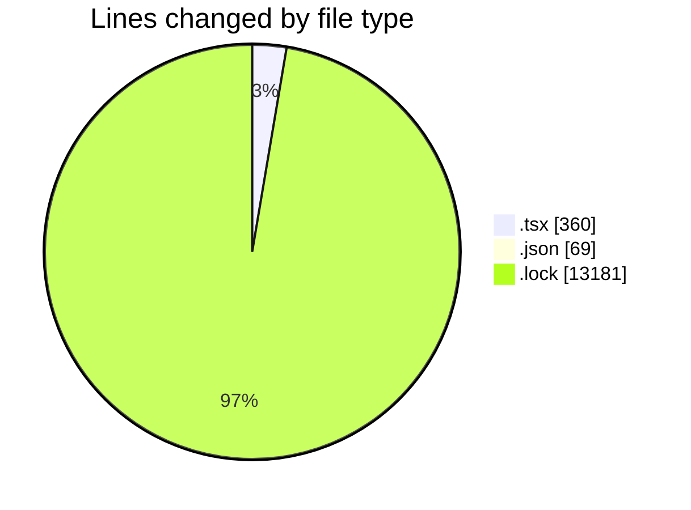
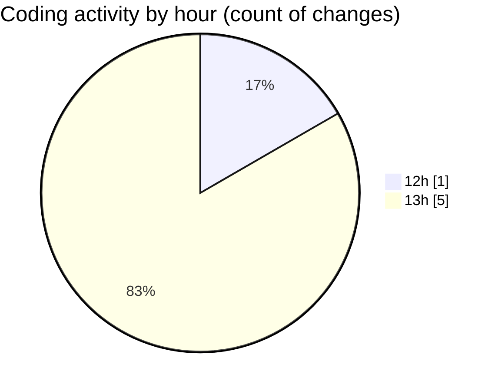

# cda - Activity Summary 

## Overall Statistics

| Stat                   | Value                                                             |
| ---------------------- | ----------------------------------------------------------------- |
| **Lines Added** (➕)   | 13606                                          |
| **Lines Removed** (➖) | 4                                        |
| **Net Change** (↕)    | 13602                |
| **Active Time** (⌚)   | 0 minute |

## Modified Files
- **App.tsx** (+234, -4)
- **package.json** (+69, -0)
- **yarn.lock** (+13181, -0)
- **App.tsx** (+122, -0)

## Visualizations

### By File Type (Lines Changed)

### By Hour (Estimated Activity Count)

> **Last Updated:** 10/03/2025, 14:01:12