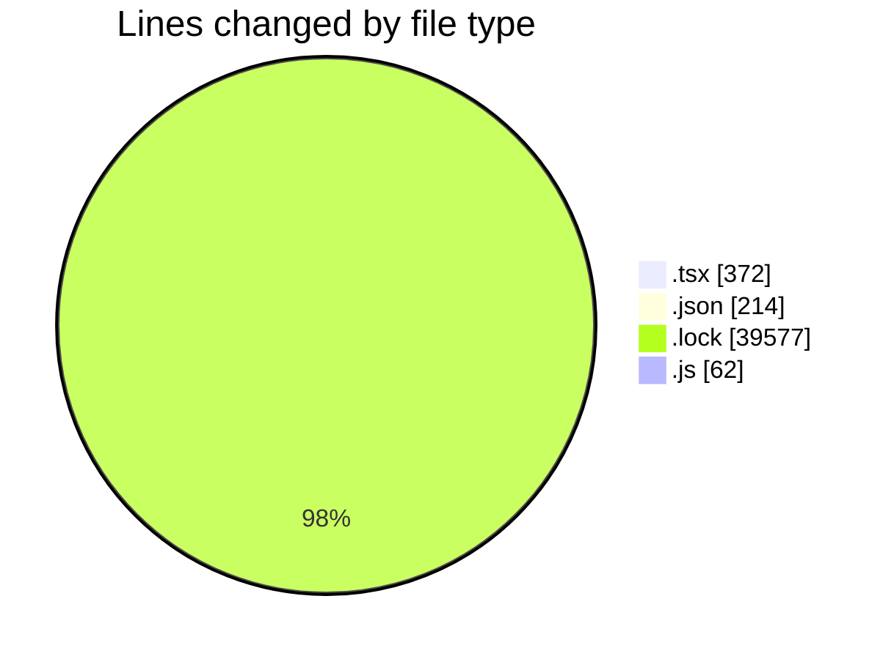
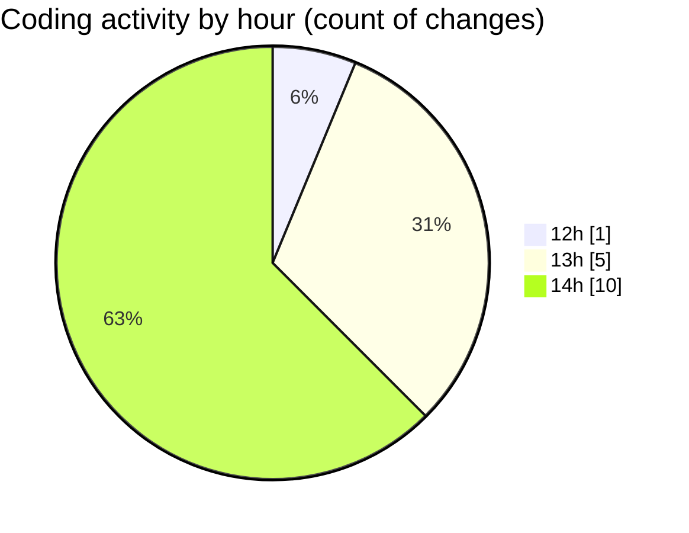

# cda - Activity Summary 

## Overall Statistics

| Stat                   | Value                                                             |
| ---------------------- | ----------------------------------------------------------------- |
| **Lines Added** (➕)   | 40209                                          |
| **Lines Removed** (➖) | 16                                        |
| **Net Change** (↕)    | 40193                |
| **Active Time** (⌚)   | 11 minutes |

## Modified Files
- **App.tsx** (+234, -4)
- **package.json** (+69, -0)
- **yarn.lock** (+13181, -0)
- **App.tsx** (+126, -8)
- **package.json** (+72, -0)
- **yarn.lock** (+13205, -0)
- **index.js** (+58, -4)
- **package.json** (+73, -0)
- **yarn.lock** (+13191, -0)

## Visualizations

### By File Type (Lines Changed)

### By Hour (Estimated Activity Count)

> **Last Updated:** 10/03/2025, 14:36:12