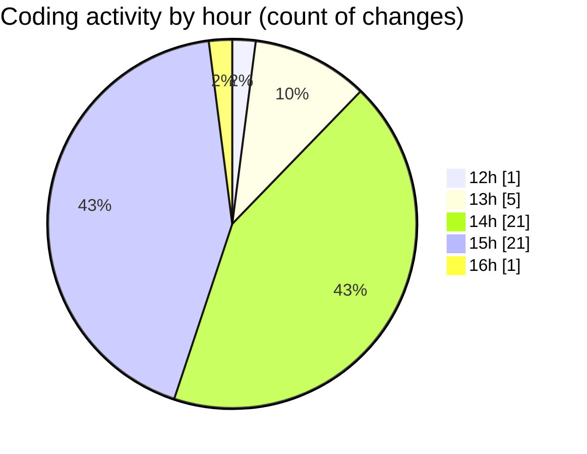

# cda - Activity Summary 

## Overall Statistics

| Stat                   | Value                                                             |
| ---------------------- | ----------------------------------------------------------------- |
| **Lines Added** (➕)   | 104530                                          |
| **Lines Removed** (➖) | 195                                        |
| **Net Change** (↕)    | 104335                |
| **Active Time** (⌚)   | 65 minutes |

## Modified Files
- **App.tsx** (+234, -4)
- **package.json** (+69, -0)
- **yarn.lock** (+13181, -10)
- **App.tsx** (+130, -8)
- **package.json** (+72, -0)
- **yarn.lock** (+13268, -0)
- **index.js** (+58, -4)
- **package.json** (+73, -0)
- **yarn.lock** (+13263, -0)
- **package.json** (+89, -0)
- **yarn.lock** (+14282, -109)
- **App.js** (+184, -4)
- **package.json** (+55, -0)
- **App.js** (+95, -4)
- **package.json** (+64, -0)
- **App.tsx** (+61, -3)
- **yarn.lock** (+13061, -46)
- **package.json** (+45, -0)
- **index.js** (+24, -0)
- **package.json** (+65, -0)
- **App.tsx** (+54, -3)
- **yarn.lock** (+13134, -0)
- **yarn.lock** (+11510, -0)
- **yarn.lock** (+11372, -0)
- **html.pug** (+70, -0)
- **duty-request.json** (+17, -0)

## Visualizations

### By File Type (Lines Changed)

### By Hour (Estimated Activity Count)

> **Last Updated:** 10/03/2025, 16:11:12