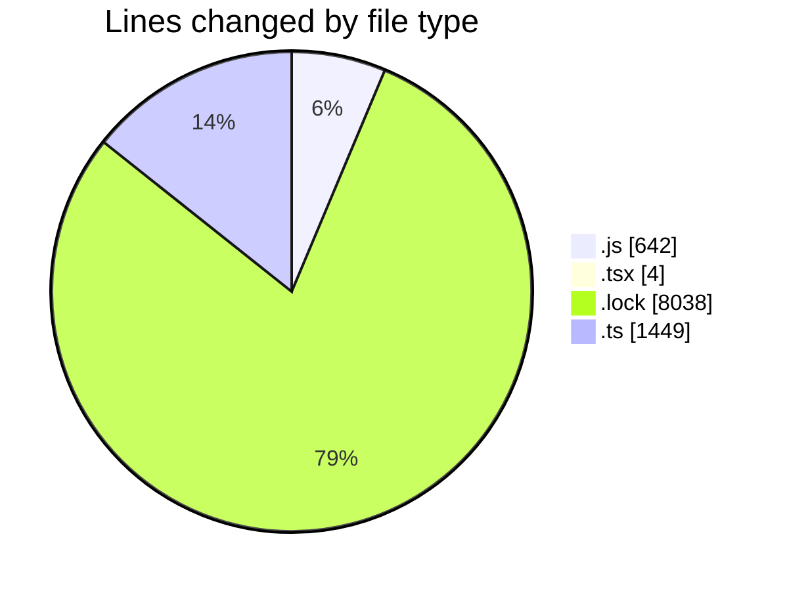
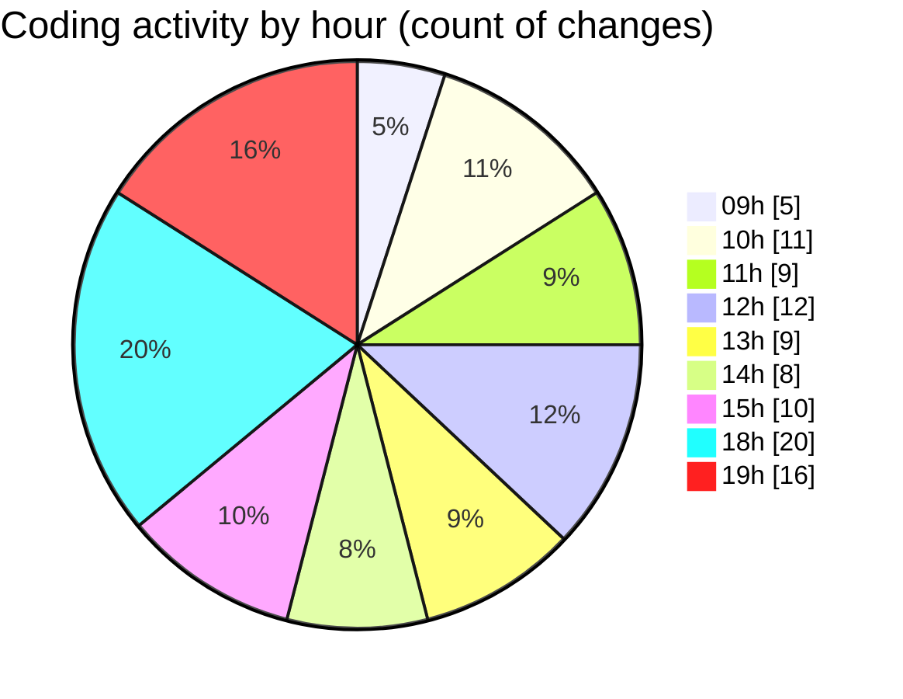

# cda - Activity Summary 

## Overall Statistics

| Stat                   | Value                                                             |
| ---------------------- | ----------------------------------------------------------------- |
| **Lines Added** (➕)   | 9734                                          |
| **Lines Removed** (➖) | 399                                        |
| **Net Change** (↕)    | 9335                |
| **Active Time** (⌚)   | 134 minutes |

## Modified Files
- **dutyRequest.js** (+273, -25)
- **20250311102747-alter-duty-request-table.js** (+17, -4)
- **20250311103639-replace-duty-requests-view.js** (+47, -4)
- **20250130140053-create-duty-request-status-history-table.js** (+24, -1)
- **20250307121920-alter-duty-request-status-history-table.js** (+13, -0)
- **duty-request.js** (+99, -9)
- **20250203122505-replace-duty-requests-view.js** (+39, -0)
- **duty-request.js** (+44, -0)
- **duty-request.js** (+43, -0)
- **App.tsx** (+0, -4)
- **yarn.lock** (+8038, -0)
- **createDutyRequest.ts** (+211, -8)
- **updateDutyRequest.ts** (+151, -0)
- **deleteDutyRequest.ts** (+90, -0)
- **getDutyRequests.ts** (+115, -0)
- **detectDutyRequestChanges.ts** (+381, -306)
- **requestRecords.ts** (+37, -0)
- **detectChanges.ts** (+75, -38)
- **createHistoryRecord.ts** (+37, -0)

## Visualizations

### By File Type (Lines Changed)

### By Hour (Estimated Activity Count)

> **Last Updated:** 11/03/2025, 19:21:14