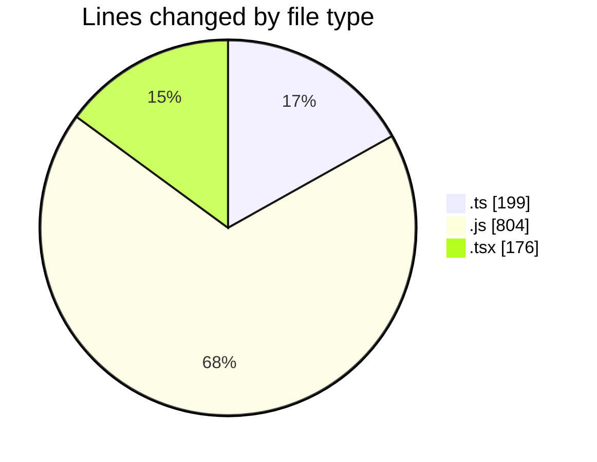
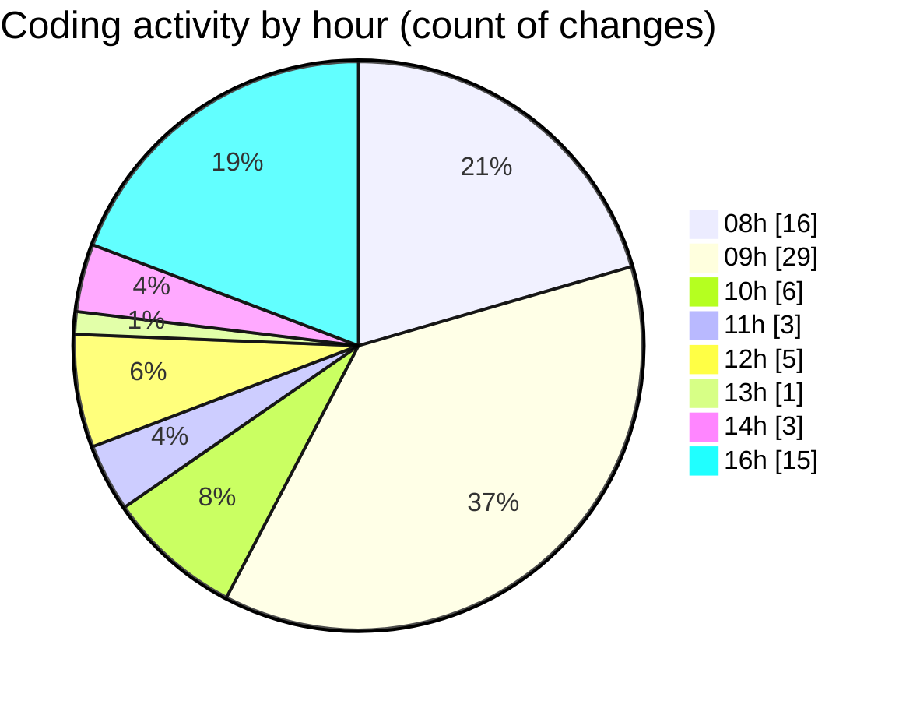

# cda - Activity Summary 

## Overall Statistics

| Stat                   | Value                                                             |
| ---------------------- | ----------------------------------------------------------------- |
| **Lines Added** (➕)   | 1034                                          |
| **Lines Removed** (➖) | 145                                        |
| **Net Change** (↕)    | 889                |
| **Active Time** (⌚)   | 123 minutes |

## Modified Files
- **createHistoryRecord.ts** (+33, -7)
- **detectChanges.ts** (+0, -36)
- **dutyRequest.js** (+332, -76)
- **historyRecord.ts** (+79, -9)
- **duty-request.js** (+98, -0)
- **deleteDutyRequest.ts** (+14, -10)
- **version.ts** (+11, -0)
- **App.tsx** (+54, -3)
- **NewAlert.tsx** (+48, -0)
- **Home.tsx** (+71, -0)
- **yesalert.js** (+85, -4)
- **yesalert.js** (+209, -0)

## Visualizations

### By File Type (Lines Changed)

### By Hour (Estimated Activity Count)

> **Last Updated:** 12/03/2025, 16:50:26