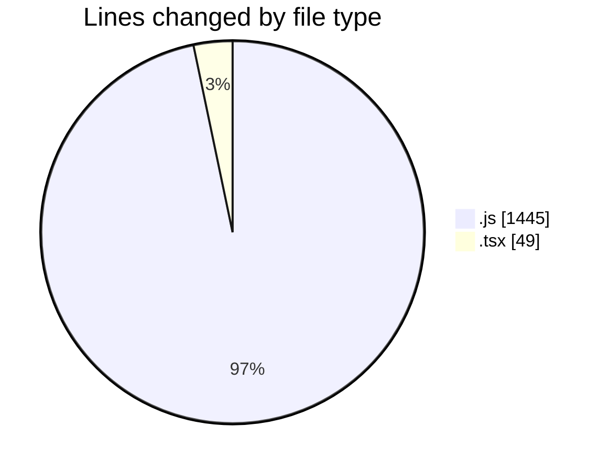
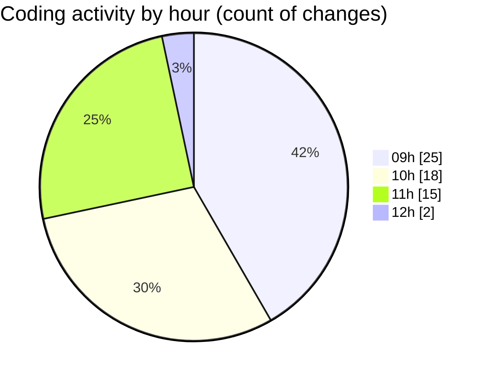

# cda - Activity Summary 

## Overall Statistics

| Stat                   | Value                                                             |
| ---------------------- | ----------------------------------------------------------------- |
| **Lines Added** (➕)   | 1119                                          |
| **Lines Removed** (➖) | 375                                        |
| **Net Change** (↕)    | 744                |
| **Active Time** (⌚)   | 101 minutes |

## Modified Files
- **yesalert.js** (+847, -367)
- **duty-request.js** (+98, -0)
- **yesalert.js** (+125, -8)
- **NewAlert.tsx** (+48, -0)
- **RecipientView.tsx** (+1, -0)

## Visualizations

### By File Type (Lines Changed)

### By Hour (Estimated Activity Count)

> **Last Updated:** 13/03/2025, 12:23:28