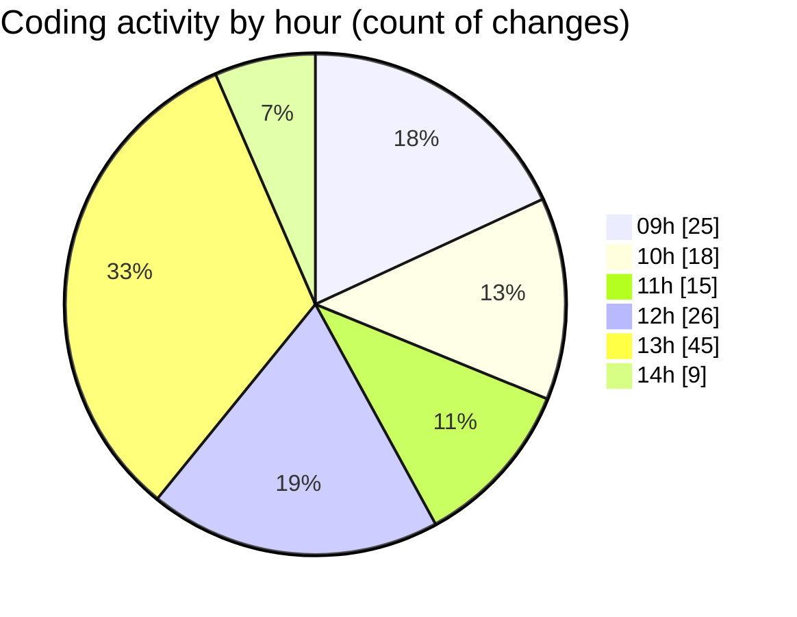

# cda - Activity Summary 

## Overall Statistics

| Stat                   | Value                                                             |
| ---------------------- | ----------------------------------------------------------------- |
| **Lines Added** (➕)   | 11533                                          |
| **Lines Removed** (➖) | 428                                        |
| **Net Change** (↕)    | 11105                |
| **Active Time** (⌚)   | 247 minutes |

## Modified Files
- **yesalert.js** (+847, -367)
- **duty-request.js** (+98, -0)
- **yesalert.js** (+125, -8)
- **NewAlert.tsx** (+66, -4)
- **RecipientView.tsx** (+129, -26)
- **index.ts** (+4, -1)
- **queries.ts** (+88, -16)
- **version.ts** (+11, -0)
- **mutations.ts** (+41, -0)
- **graphql.ts** (+4478, -6)
- **gql.ts** (+46, -0)
- **graphql.ts** (+5530, -0)
- **gql.ts** (+70, -0)

## Visualizations

### By File Type (Lines Changed)

### By Hour (Estimated Activity Count)

> **Last Updated:** 13/03/2025, 14:08:28