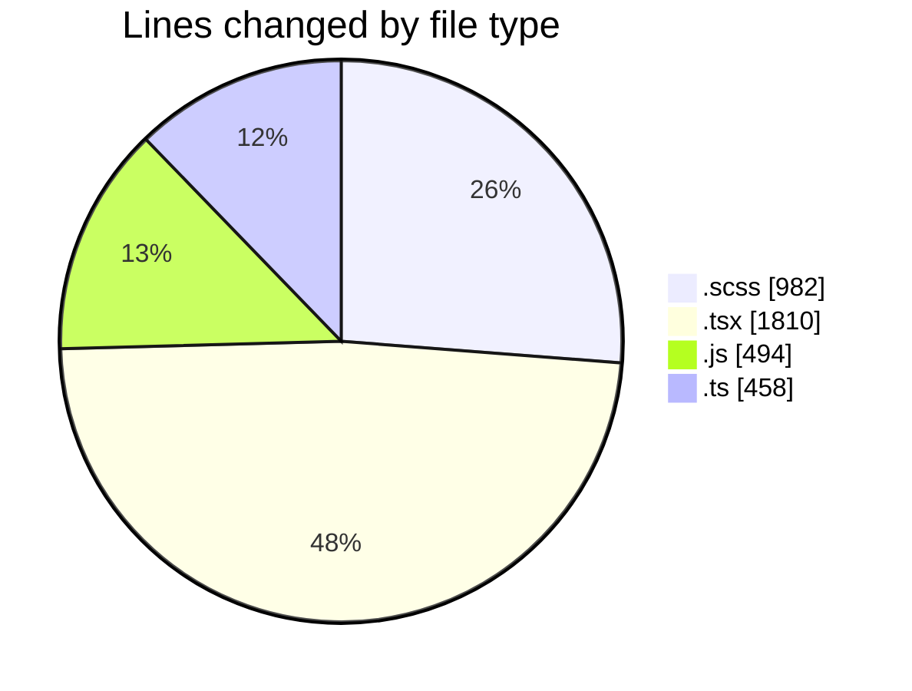
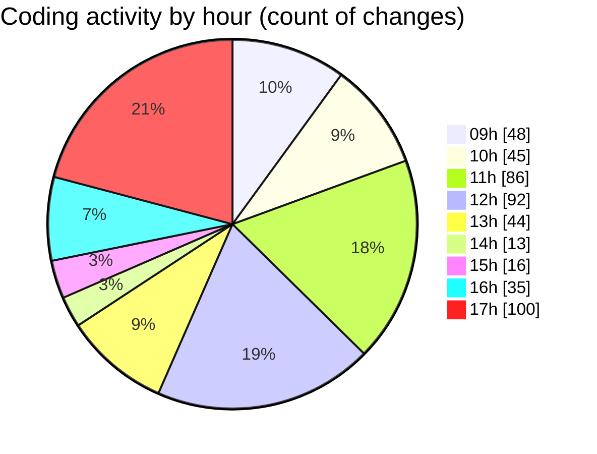

# cda - Activity Summary 

## Overall Statistics

| Stat                   | Value                                                             |
| ---------------------- | ----------------------------------------------------------------- |
| **Lines Added** (➕)   | 2827                                          |
| **Lines Removed** (➖) | 917                                        |
| **Net Change** (↕)    | 1910                |
| **Active Time** (⌚)   | 648 minutes |

## Modified Files
- **RecipientView.scss** (+444, -317)
- **RecipientView.tsx** (+211, -171)
- **yesalert.js** (+36, -36)
- **queries.ts** (+29, -29)
- **yesalert.js** (+217, -205)
- **NewAlert.tsx** (+26, -15)
- **Duty.test.tsx** (+191, -2)
- **App.tsx** (+238, -4)
- **TeamViewRow.tsx** (+125, -2)
- **dutyTimeHelpers.ts** (+34, -0)
- **me.ts** (+319, -1)
- **Duty.tsx** (+119, -0)
- **Job.tsx** (+44, -0)
- **MonthlyViewRow.tsx** (+94, -0)
- **RotaPattern.ts** (+46, -0)
- **AlertForm.tsx** (+289, -20)
- **AlertForm.test.tsx** (+187, -36)
- **SendToYourself.tsx** (+31, -2)
- **index.tsx** (+3, -0)
- **SendToYourself.scss** (+108, -76)
- **AlertForm.scss** (+36, -1)

## Visualizations

### By File Type (Lines Changed)

### By Hour (Estimated Activity Count)

> **Last Updated:** 14/03/2025, 17:58:30