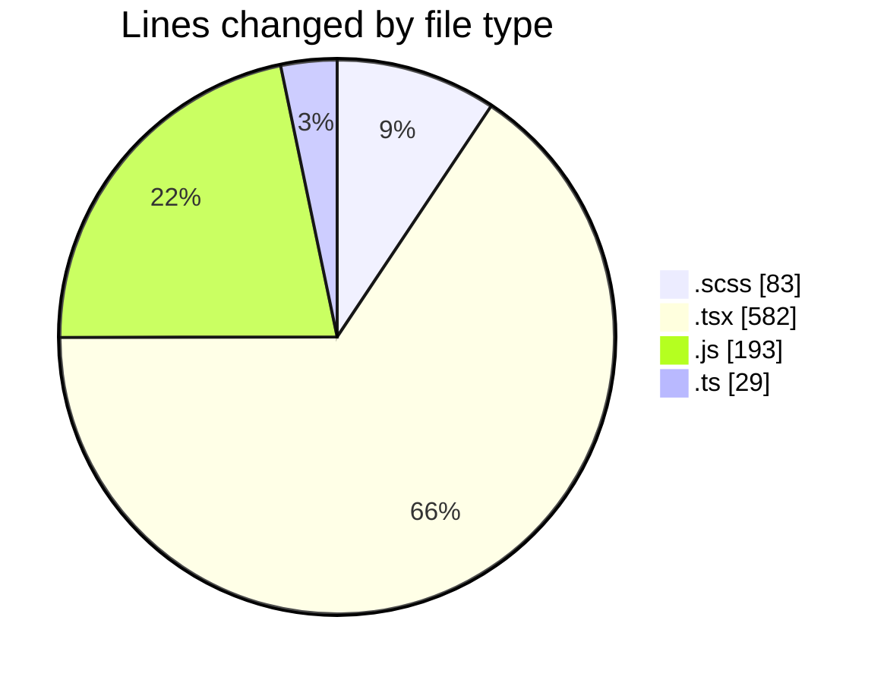

# cda - Activity Summary 

## Overall Statistics

| Stat                   | Value                                                             |
| ---------------------- | ----------------------------------------------------------------- |
| **Lines Added** (➕)   | 600                                          |
| **Lines Removed** (➖) | 287                                        |
| **Net Change** (↕)    | 313                |
| **Active Time** (⌚)   | 60 minutes |

## Modified Files
- **RecipientView.scss** (+42, -41)
- **RecipientView.tsx** (+4, -4)
- **yesalert.js** (+0, -36)
- **queries.ts** (+0, -29)
- **yesalert.js** (+0, -157)
- **NewAlert.tsx** (+0, -14)
- **Duty.test.tsx** (+191, -0)
- **App.tsx** (+238, -4)
- **TeamViewRow.tsx** (+125, -2)

## Visualizations

### By File Type (Lines Changed)

### By Hour (Estimated Activity Count)

> **Last Updated:** 14/03/2025, 09:53:29