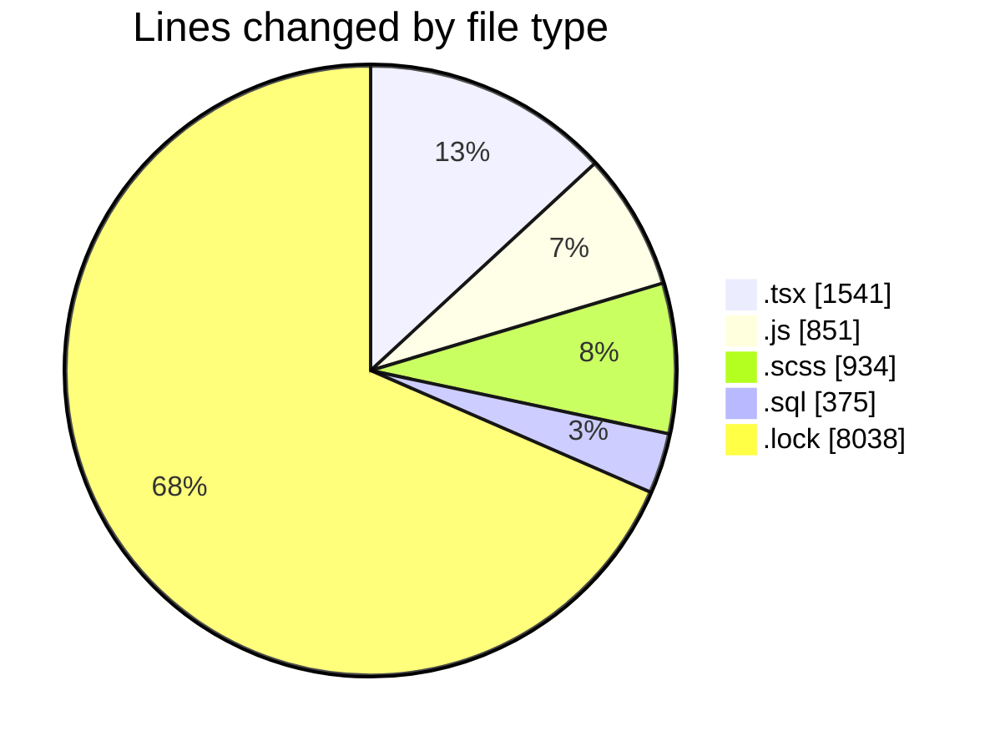
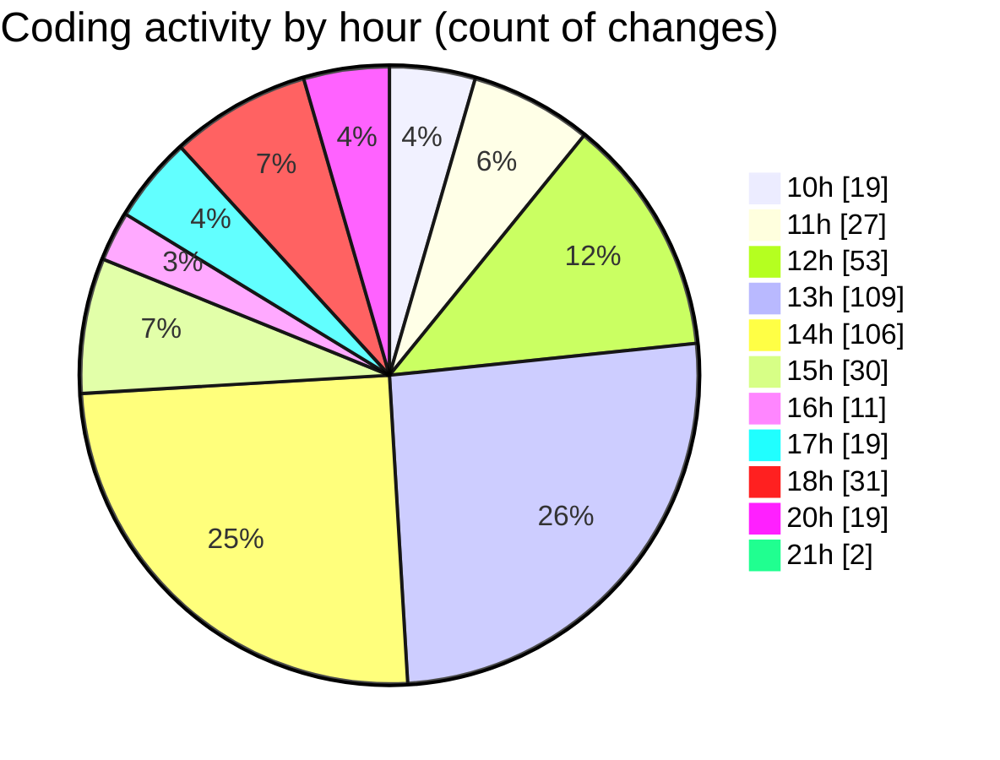

# cda - Activity Summary 

## Overall Statistics

| Stat                   | Value                                                             |
| ---------------------- | ----------------------------------------------------------------- |
| **Lines Added** (➕)   | 11082                                          |
| **Lines Removed** (➖) | 657                                        |
| **Net Change** (↕)    | 10425                |
| **Active Time** (⌚)   | 553 minutes |

## Modified Files
- **SendToYourself.tsx** (+343, -19)
- **yesalert.js** (+376, -21)
- **NewAlert.tsx** (+173, -15)
- **AlertForm.tsx** (+576, -231)
- **RecipientView.scss** (+127, -0)
- **yesalert.js** (+104, -0)
- **yesalert.js** (+91, -0)
- **create-users.sql** (+375, -0)
- **yarn.lock** (+8038, -0)
- **yesalert-queries.js** (+259, -0)
- **AlertForm.scss** (+463, -344)
- **AlertForm.test.tsx** (+151, -27)
- **index.tsx** (+6, -0)

## Visualizations

### By File Type (Lines Changed)

### By Hour (Estimated Activity Count)

> **Last Updated:** 18/03/2025, 21:04:22