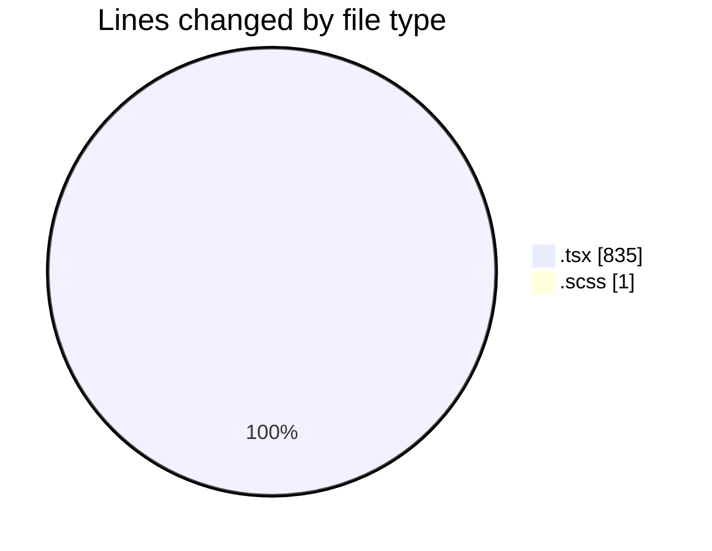
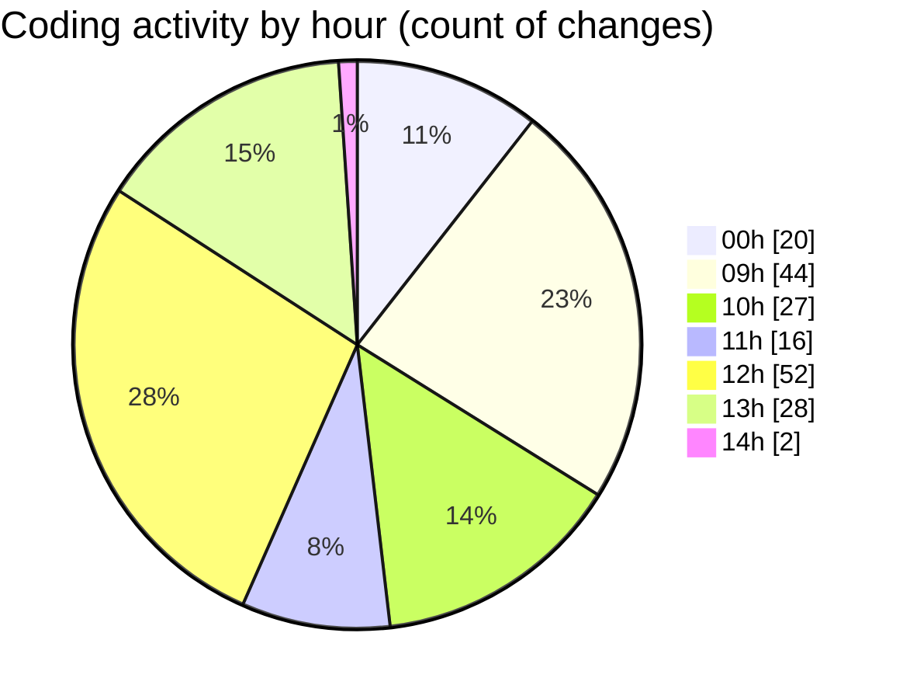

# cda - Activity Summary 

## Overall Statistics

| Stat                   | Value                                                             |
| ---------------------- | ----------------------------------------------------------------- |
| **Lines Added** (➕)   | 534                                          |
| **Lines Removed** (➖) | 302                                        |
| **Net Change** (↕)    | 232                |
| **Active Time** (⌚)   | 303 minutes |

## Modified Files
- **SendAlert.tsx** (+85, -89)
- **AlertForm.tsx** (+331, -114)
- **NewAlert.tsx** (+117, -99)
- **AlertForm.scss** (+1, -0)

## Visualizations

### By File Type (Lines Changed)

### By Hour (Estimated Activity Count)

> **Last Updated:** 19/03/2025, 14:40:13