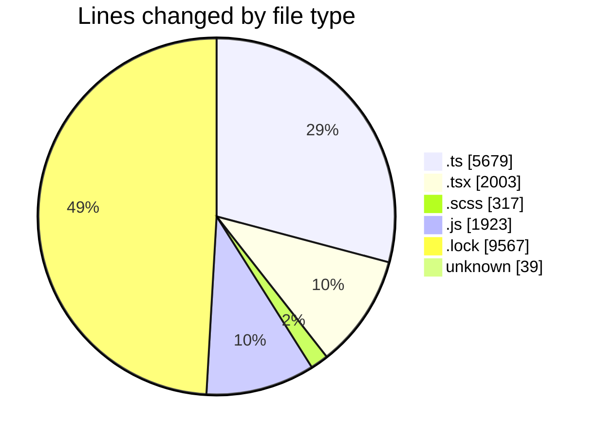
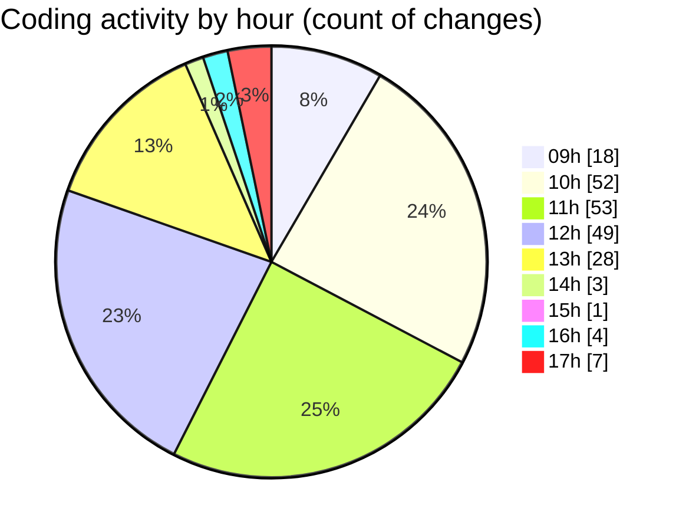

# cda - Activity Summary 

## Overall Statistics

| Stat                   | Value                                                             |
| ---------------------- | ----------------------------------------------------------------- |
| **Lines Added** (➕)   | 18266                                          |
| **Lines Removed** (➖) | 1262                                        |
| **Net Change** (↕)    | 17004                |
| **Active Time** (⌚)   | 317 minutes |

## Modified Files
- **version.ts** (+11, -0)
- **App.tsx** (+52, -1)
- **SendAlert.tsx** (+136, -23)
- **NewAlert.tsx** (+179, -131)
- **SendAlert.scss** (+113, -63)
- **SendAler.test.tsx** (+127, -57)
- **AlertForm.test.tsx** (+190, -45)
- **AlertForm.tsx** (+263, -9)
- **SendAlert.test.tsx** (+70, -15)
- **NewAlert.scss** (+11, -3)
- **queries.ts** (+17, -3)
- **mutations.ts** (+41, -22)
- **NewAlert.test.tsx** (+365, -152)
- **RecipientView.tsx** (+188, -0)
- **RecipientView.scss** (+127, -0)
- **yesalert.js** (+928, -585)
- **queries.ts** (+85, -0)
- **yesalert.js** (+257, -153)
- **gql.ts** (+26, -0)
- **graphql.ts** (+5428, -0)
- **gql.ts** (+46, -0)
- **yarn.lock** (+7951, -0)
- **.env** (+39, -0)
- **yarn.lock** (+1616, -0)

## Visualizations

### By File Type (Lines Changed)

### By Hour (Estimated Activity Count)

> **Last Updated:** 21/03/2025, 17:12:19