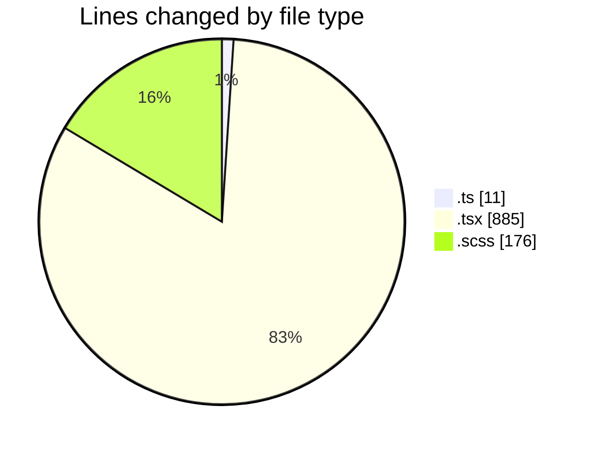
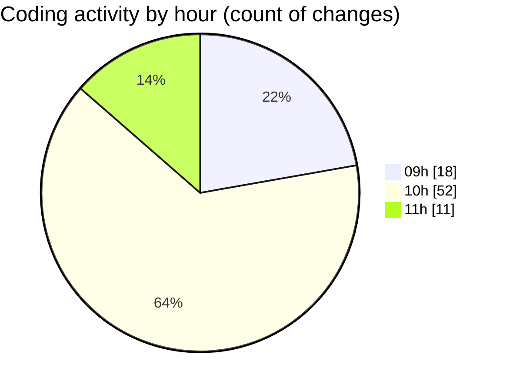

# cda - Activity Summary 

## Overall Statistics

| Stat                   | Value                                                             |
| ---------------------- | ----------------------------------------------------------------- |
| **Lines Added** (➕)   | 859                                          |
| **Lines Removed** (➖) | 213                                        |
| **Net Change** (↕)    | 646                |
| **Active Time** (⌚)   | 111 minutes |

## Modified Files
- **version.ts** (+11, -0)
- **App.tsx** (+52, -0)
- **SendAlert.tsx** (+136, -23)
- **NewAlert.tsx** (+174, -61)
- **SendAlert.scss** (+113, -63)
- **SendAler.test.tsx** (+127, -57)
- **AlertForm.test.tsx** (+79, -0)
- **AlertForm.tsx** (+167, -9)

## Visualizations

### By File Type (Lines Changed)

### By Hour (Estimated Activity Count)

> **Last Updated:** 21/03/2025, 11:12:18