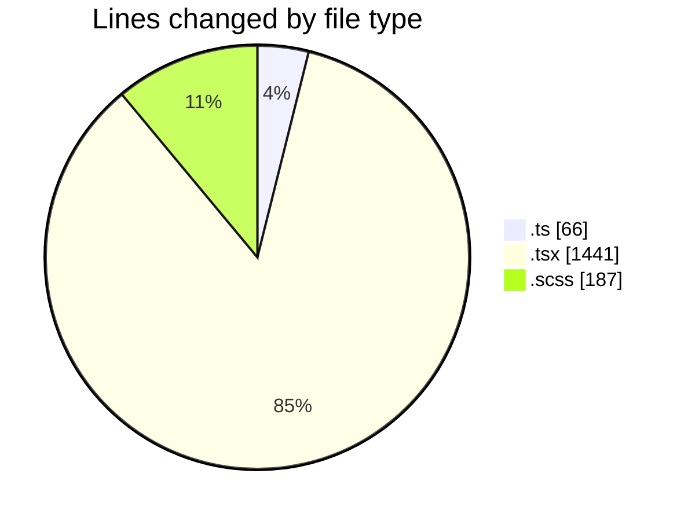
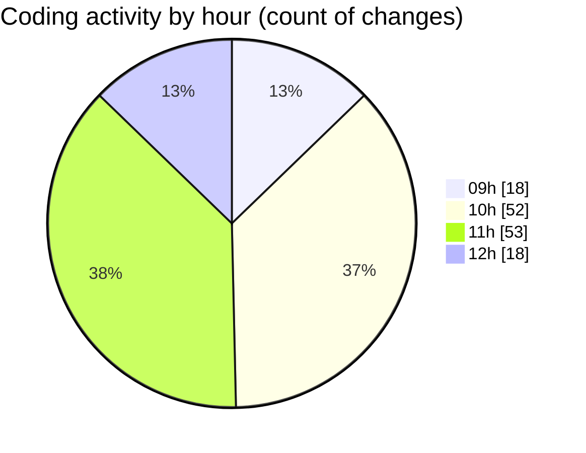

# cda - Activity Summary 

## Overall Statistics

| Stat                   | Value                                                             |
| ---------------------- | ----------------------------------------------------------------- |
| **Lines Added** (➕)   | 1296                                          |
| **Lines Removed** (➖) | 398                                        |
| **Net Change** (↕)    | 898                |
| **Active Time** (⌚)   | 202 minutes |

## Modified Files
- **version.ts** (+11, -0)
- **App.tsx** (+52, -1)
- **SendAlert.tsx** (+136, -23)
- **NewAlert.tsx** (+174, -61)
- **SendAlert.scss** (+113, -63)
- **SendAler.test.tsx** (+127, -57)
- **AlertForm.test.tsx** (+126, -45)
- **AlertForm.tsx** (+167, -9)
- **SendAlert.test.tsx** (+70, -15)
- **NewAlert.scss** (+11, -0)
- **queries.ts** (+14, -0)
- **mutations.ts** (+41, -0)
- **NewAlert.test.tsx** (+254, -124)

## Visualizations

### By File Type (Lines Changed)

### By Hour (Estimated Activity Count)

> **Last Updated:** 21/03/2025, 12:12:18