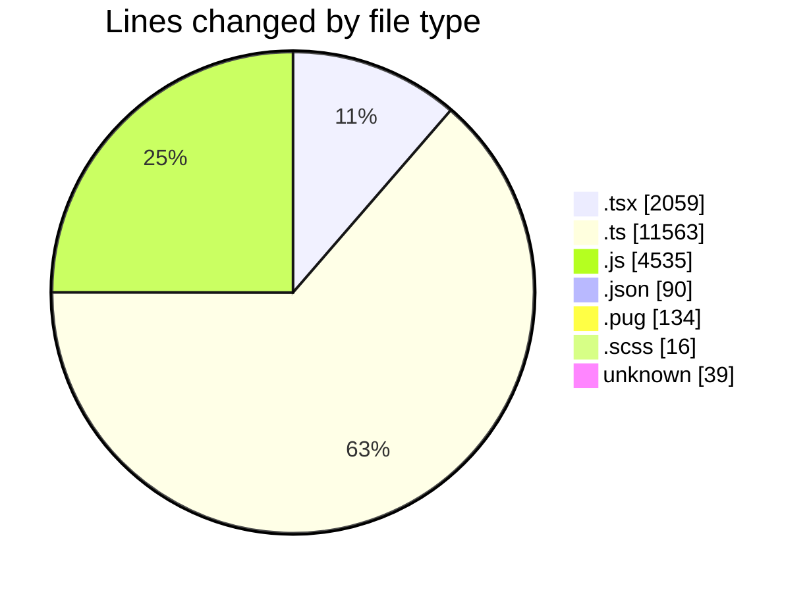
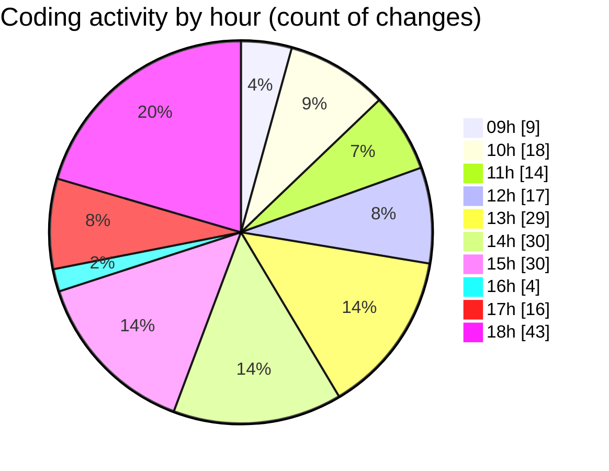

# cda - Activity Summary 

## Overall Statistics

| Stat                   | Value                                                             |
| ---------------------- | ----------------------------------------------------------------- |
| **Lines Added** (➕)   | 17126                                          |
| **Lines Removed** (➖) | 1310                                        |
| **Net Change** (↕)    | 15816                |
| **Active Time** (⌚)   | 339 minutes |

## Modified Files
- **RecipientView.tsx** (+385, -7)
- **gql.ts** (+101, -12)
- **queries.ts** (+291, -147)
- **queries.ts** (+37, -12)
- **yesalert.js** (+1185, -354)
- **yesalert.js** (+394, -100)
- **NewAlert.tsx** (+421, -260)
- **dutyRequest.js** (+251, -0)
- **yesalert.json** (+15, -0)
- **html.pug** (+130, -4)
- **yesalert-mutations.js** (+1838, -413)
- **AlertForm.tsx** (+508, -0)
- **settings.json** (+74, -1)
- **index.ts** (+3, -0)
- **GroupMember.tsx** (+188, -0)
- **index.ts** (+3, -0)
- **version.ts** (+11, -0)
- **NewAlert.scss** (+16, -0)
- **mutations.ts** (+38, -0)
- **gql.ts** (+52, -0)
- **AlertForm.test.tsx** (+290, -0)
- **graphql.ts** (+10856, -0)
- **.env** (+39, -0)

## Visualizations

### By File Type (Lines Changed)

### By Hour (Estimated Activity Count)

> **Last Updated:** 24/03/2025, 18:33:17