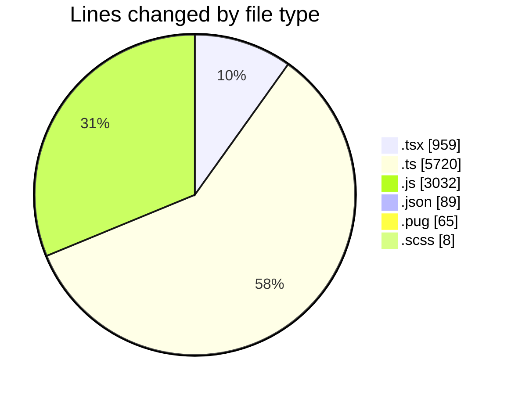
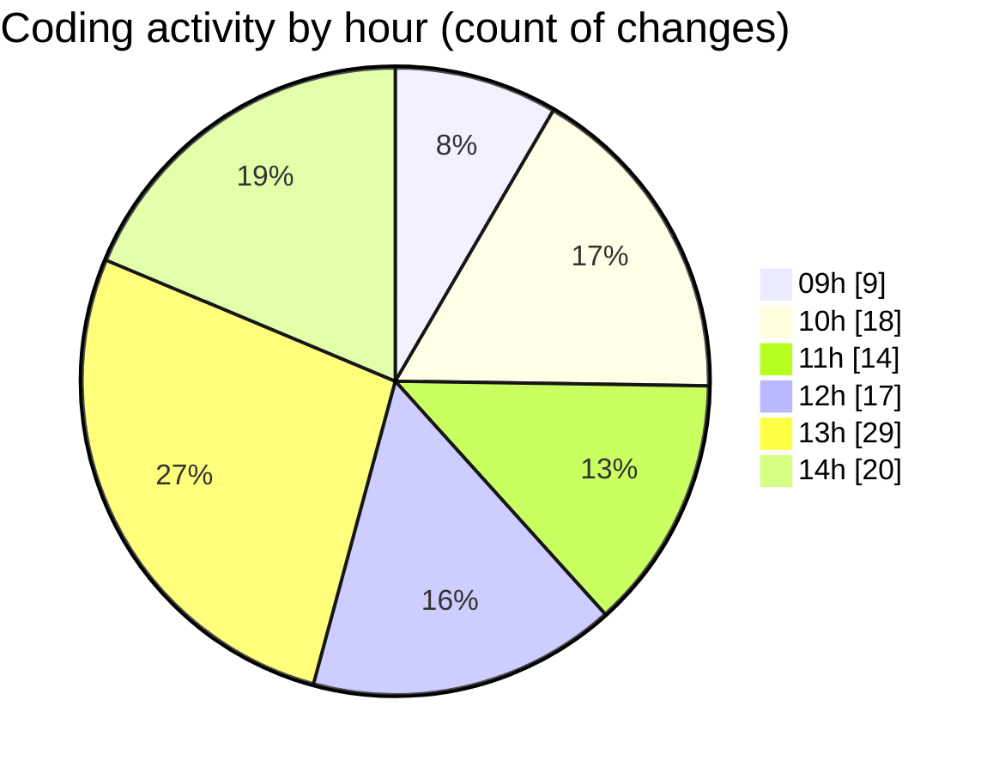

# cda - Activity Summary 

## Overall Statistics

| Stat                   | Value                                                             |
| ---------------------- | ----------------------------------------------------------------- |
| **Lines Added** (➕)   | 8988                                          |
| **Lines Removed** (➖) | 885                                        |
| **Net Change** (↕)    | 8103                |
| **Active Time** (⌚)   | 186 minutes |

## Modified Files
- **RecipientView.tsx** (+191, -3)
- **gql.ts** (+46, -3)
- **queries.ts** (+110, -54)
- **queries.ts** (+14, -3)
- **yesalert.js** (+696, -284)
- **yesalert.js** (+228, -86)
- **NewAlert.tsx** (+113, -65)
- **dutyRequest.js** (+251, -0)
- **yesalert.json** (+15, -0)
- **html.pug** (+65, -0)
- **yesalert-mutations.js** (+1101, -386)
- **AlertForm.tsx** (+254, -0)
- **settings.json** (+73, -1)
- **index.ts** (+3, -0)
- **GroupMember.tsx** (+188, -0)
- **index.ts** (+3, -0)
- **version.ts** (+11, -0)
- **NewAlert.scss** (+8, -0)
- **mutations.ts** (+19, -0)
- **gql.ts** (+26, -0)
- **AlertForm.test.tsx** (+145, -0)
- **graphql.ts** (+5428, -0)

## Visualizations

### By File Type (Lines Changed)

### By Hour (Estimated Activity Count)

> **Last Updated:** 24/03/2025, 14:25:59