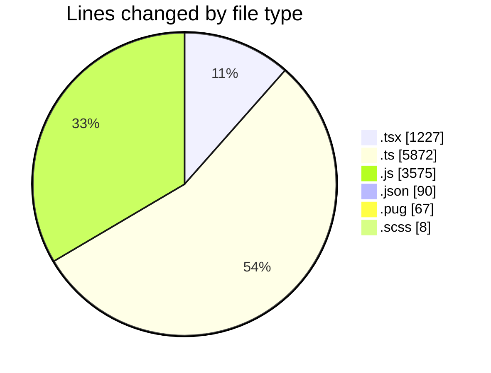
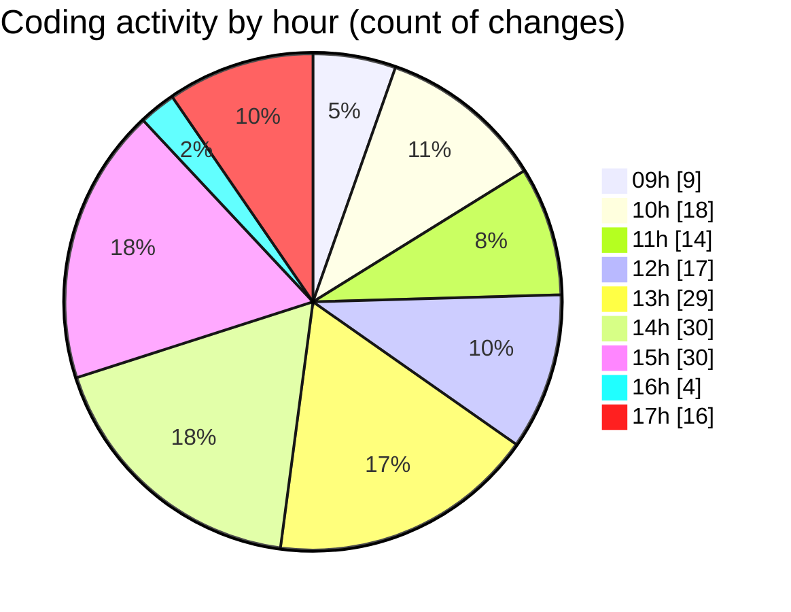

# cda - Activity Summary 

## Overall Statistics

| Stat                   | Value                                                             |
| ---------------------- | ----------------------------------------------------------------- |
| **Lines Added** (➕)   | 9684                                          |
| **Lines Removed** (➖) | 1155                                        |
| **Net Change** (↕)    | 8529                |
| **Active Time** (⌚)   | 255 minutes |

## Modified Files
- **RecipientView.tsx** (+195, -7)
- **gql.ts** (+52, -9)
- **queries.ts** (+174, -118)
- **queries.ts** (+20, -9)
- **yesalert.js** (+1157, -323)
- **yesalert.js** (+242, -95)
- **NewAlert.tsx** (+243, -195)
- **dutyRequest.js** (+251, -0)
- **yesalert.json** (+15, -0)
- **html.pug** (+65, -2)
- **yesalert-mutations.js** (+1111, -396)
- **AlertForm.tsx** (+254, -0)
- **settings.json** (+74, -1)
- **index.ts** (+3, -0)
- **GroupMember.tsx** (+188, -0)
- **index.ts** (+3, -0)
- **version.ts** (+11, -0)
- **NewAlert.scss** (+8, -0)
- **mutations.ts** (+19, -0)
- **gql.ts** (+26, -0)
- **AlertForm.test.tsx** (+145, -0)
- **graphql.ts** (+5428, -0)

## Visualizations

### By File Type (Lines Changed)

### By Hour (Estimated Activity Count)

> **Last Updated:** 24/03/2025, 17:53:17