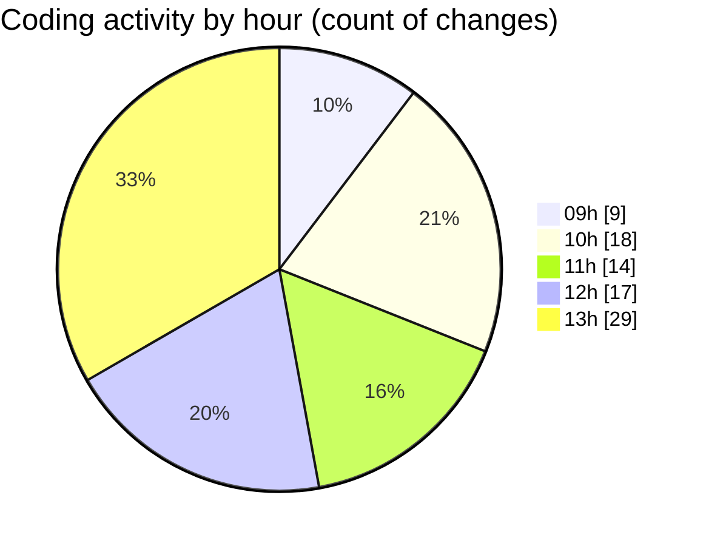

# cda - Activity Summary 

## Overall Statistics

| Stat                   | Value                                                             |
| ---------------------- | ----------------------------------------------------------------- |
| **Lines Added** (➕)   | 3243                                          |
| **Lines Removed** (➖) | 777                                        |
| **Net Change** (↕)    | 2466                |
| **Active Time** (⌚)   | 164 minutes |

## Modified Files
- **RecipientView.tsx** (+188, -1)
- **gql.ts** (+46, -0)
- **queries.ts** (+105, -19)
- **queries.ts** (+14, -0)
- **yesalert.js** (+686, -284)
- **yesalert.js** (+228, -86)
- **NewAlert.tsx** (+113, -0)
- **dutyRequest.js** (+251, -0)
- **yesalert.json** (+15, -0)
- **html.pug** (+65, -0)
- **yesalert-mutations.js** (+1096, -386)
- **AlertForm.tsx** (+158, -0)
- **settings.json** (+73, -1)
- **index.ts** (+3, -0)
- **GroupMember.tsx** (+188, -0)
- **index.ts** (+3, -0)
- **version.ts** (+11, -0)

## Visualizations

### By File Type (Lines Changed)

### By Hour (Estimated Activity Count)

> **Last Updated:** 24/03/2025, 14:00:59