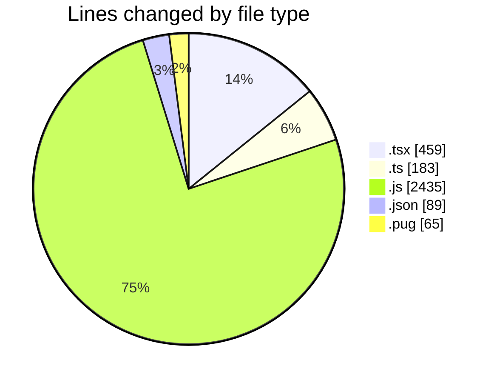
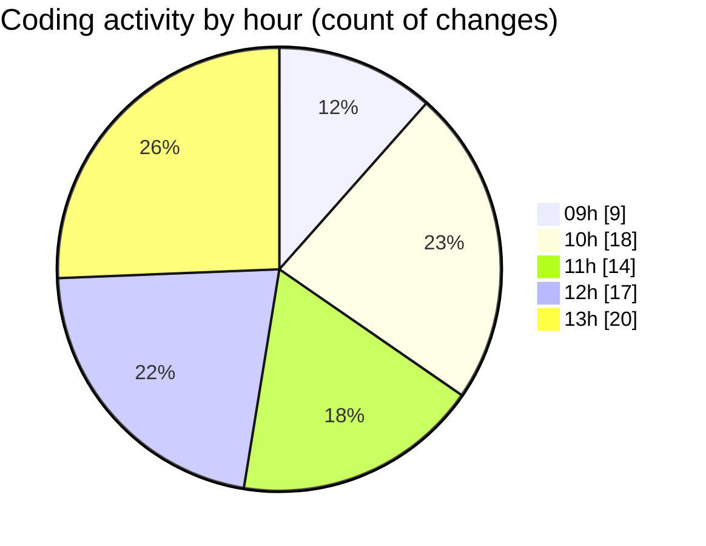

# cda - Activity Summary 

## Overall Statistics

| Stat                   | Value                                                             |
| ---------------------- | ----------------------------------------------------------------- |
| **Lines Added** (➕)   | 2455                                          |
| **Lines Removed** (➖) | 776                                        |
| **Net Change** (↕)    | 1679                |
| **Active Time** (⌚)   | 142 minutes |

## Modified Files
- **RecipientView.tsx** (+188, -0)
- **gql.ts** (+46, -0)
- **queries.ts** (+104, -19)
- **queries.ts** (+14, -0)
- **yesalert.js** (+470, -284)
- **yesalert.js** (+154, -86)
- **NewAlert.tsx** (+113, -0)
- **dutyRequest.js** (+251, -0)
- **yesalert.json** (+15, -0)
- **html.pug** (+65, -0)
- **yesalert-mutations.js** (+804, -386)
- **AlertForm.tsx** (+158, -0)
- **settings.json** (+73, -1)

## Visualizations

### By File Type (Lines Changed)

### By Hour (Estimated Activity Count)

> **Last Updated:** 24/03/2025, 13:45:59