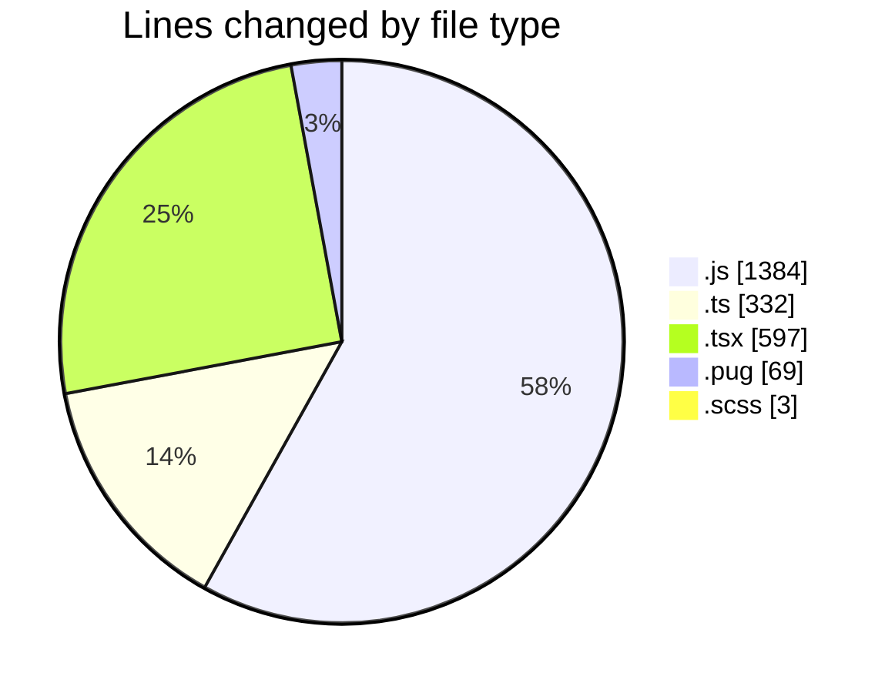
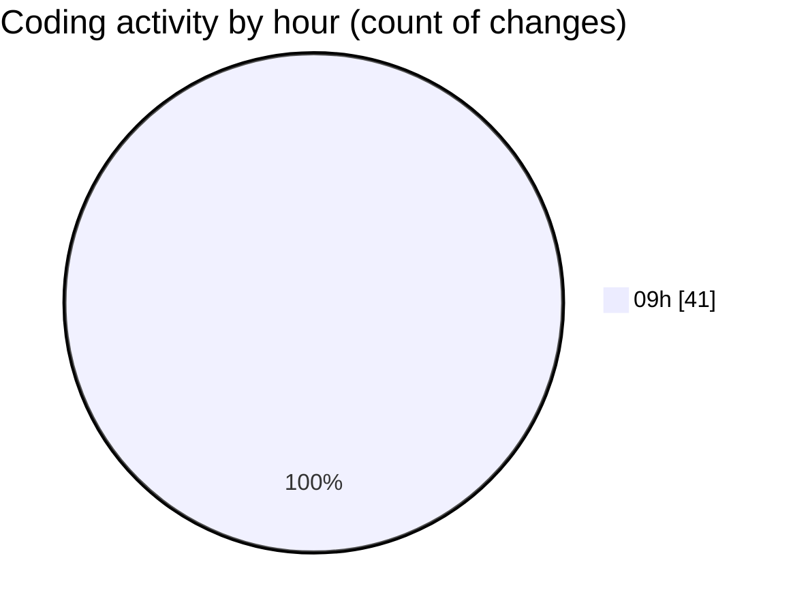

# cda - Activity Summary 

## Overall Statistics

| Stat                   | Value                                                             |
| ---------------------- | ----------------------------------------------------------------- |
| **Lines Added** (➕)   | 2069                                          |
| **Lines Removed** (➖) | 316                                        |
| **Net Change** (↕)    | 1753                |
| **Active Time** (⌚)   | 38 minutes |

## Modified Files
- **yesalert.js** (+438, -24)
- **queries.ts** (+120, -32)
- **RecipientView.tsx** (+192, -2)
- **yesalert.js** (+157, -10)
- **queries.ts** (+3, -3)
- **gql.ts** (+3, -3)
- **NewAlert.tsx** (+178, -65)
- **yesalert-mutations.js** (+740, -15)
- **html.pug** (+67, -2)
- **NewAlert.scss** (+3, -0)
- **AlertForm.test.tsx** (+0, -64)
- **AlertForm.tsx** (+0, -96)
- **gql.ts** (+44, -0)
- **graphql.ts** (+102, -0)
- **mutations.ts** (+22, -0)

## Visualizations

### By File Type (Lines Changed)

### By Hour (Estimated Activity Count)

> **Last Updated:** 25/03/2025, 09:28:10