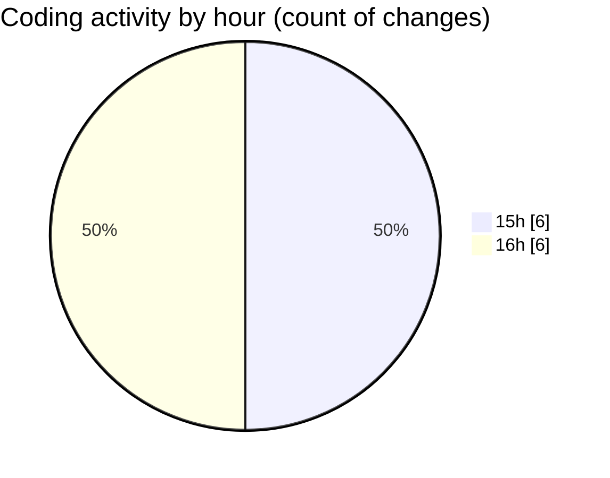

# samplePdf - Activity Summary 

## Overall Statistics

| Stat                   | Value                                                             |
| ---------------------- | ----------------------------------------------------------------- |
| **Lines Added** (➕)   | 367                                          |
| **Lines Removed** (➖) | 1                                        |
| **Net Change** (↕)    | 366                |
| **Active Time** (⌚)   | 10 minutes |

## Modified Files
- **app.py** (+101, -0)
- **database_module.py** (+207, -1)
- **pdf_processing.py** (+59, -0)

## Visualizations

### By File Type (Lines Changed)

### By Hour (Estimated Activity Count)

> **Last Updated:** 25/03/2025, 16:24:30