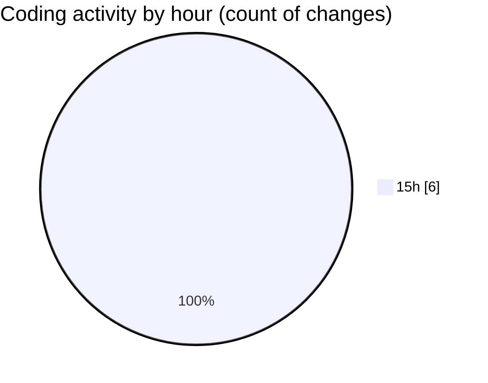

# samplePdf - Activity Summary 

## Overall Statistics

| Stat                   | Value                                                             |
| ---------------------- | ----------------------------------------------------------------- |
| **Lines Added** (➕)   | 303                                          |
| **Lines Removed** (➖) | 0                                        |
| **Net Change** (↕)    | 303                |
| **Active Time** (⌚)   | 6 minutes |

## Modified Files
- **app.py** (+101, -0)
- **database_module.py** (+202, -0)

## Visualizations

### By File Type (Lines Changed)

### By Hour (Estimated Activity Count)

> **Last Updated:** 25/03/2025, 15:59:30