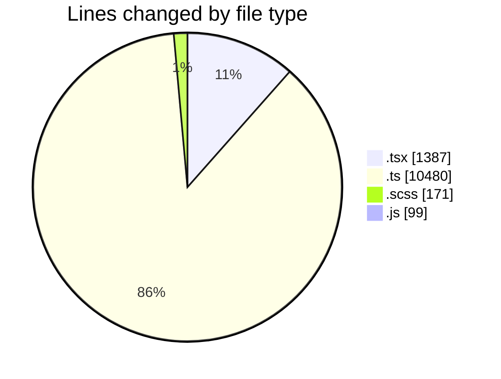
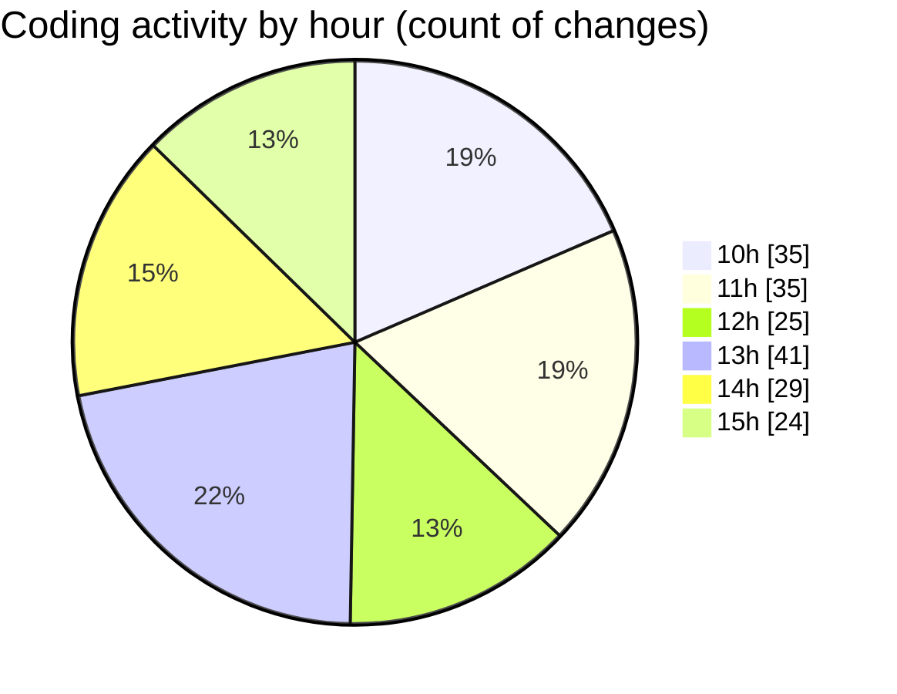

# cda - Activity Summary 

## Overall Statistics

| Stat                   | Value                                                             |
| ---------------------- | ----------------------------------------------------------------- |
| **Lines Added** (➕)   | 11845                                          |
| **Lines Removed** (➖) | 292                                        |
| **Net Change** (↕)    | 11553                |
| **Active Time** (⌚)   | 262 minutes |

## Modified Files
- **NewAlert.tsx** (+48, -0)
- **queries.ts** (+11, -0)
- **mutations.ts** (+19, -0)
- **NewAlert.scss** (+8, -0)
- **gql.ts** (+26, -0)
- **AlertForm.test.tsx** (+145, -0)
- **AlertForm.tsx** (+254, -0)
- **graphql.ts** (+5428, -0)
- **gql.ts** (+43, -0)
- **queries.ts** (+56, -0)
- **App.tsx** (+61, -0)
- **Home.tsx** (+72, -21)
- **queries.ts** (+70, -0)
- **duty-request.js** (+98, -1)
- **mutations.ts** (+85, -0)
- **RequestWrapper.tsx** (+78, -35)
- **RequestCard.tsx** (+306, -189)
- **graphql.ts** (+4709, -0)
- **RequestCard.test.tsx** (+48, -0)
- **RequestView.test.tsx** (+69, -1)
- **RequestEditModal.tsx** (+56, -1)
- **index.tsx** (+3, -0)
- **RequestCard.scss** (+119, -44)
- **types.ts** (+33, -0)

## Visualizations

### By File Type (Lines Changed)

### By Hour (Estimated Activity Count)

> **Last Updated:** 26/03/2025, 15:29:38