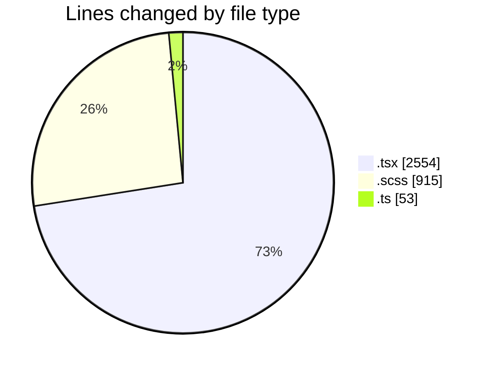
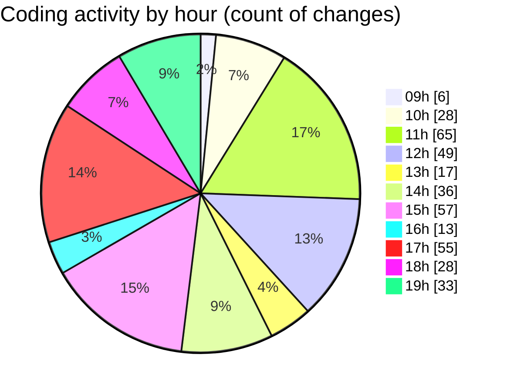

# cda - Activity Summary 

## Overall Statistics

| Stat                   | Value                                                             |
| ---------------------- | ----------------------------------------------------------------- |
| **Lines Added** (➕)   | 2783                                          |
| **Lines Removed** (➖) | 739                                        |
| **Net Change** (↕)    | 2044                |
| **Active Time** (⌚)   | 564 minutes |

## Modified Files
- **RequestEditModal.tsx** (+500, -286)
- **RequestEditModal.scss** (+520, -328)
- **RequestEditModal.test.tsx** (+109, -27)
- **Home.tsx** (+138, -54)
- **Home.scss** (+67, -0)
- **RequestCard.tsx** (+158, -19)
- **types.ts** (+42, -2)
- **RequestWrapper.tsx** (+43, -2)
- **RequestForm.test.tsx** (+99, -8)
- **RequestCard.test.tsx** (+48, -5)
- **App.tsx** (+61, -0)
- **Admin.tsx** (+151, -0)
- **index.ts** (+3, -0)
- **UserView.test.tsx** (+68, -0)
- **UserView.tsx** (+185, -0)
- **UserView.test.tsx** (+68, -0)
- **index.ts** (+3, -0)
- **RequestView.test.tsx** (+68, -0)
- **RequestView.tsx** (+185, -0)
- **index.ts** (+3, -0)
- **UserView.tsx** (+264, -8)

## Visualizations

### By File Type (Lines Changed)

### By Hour (Estimated Activity Count)

> **Last Updated:** 27/03/2025, 19:57:22