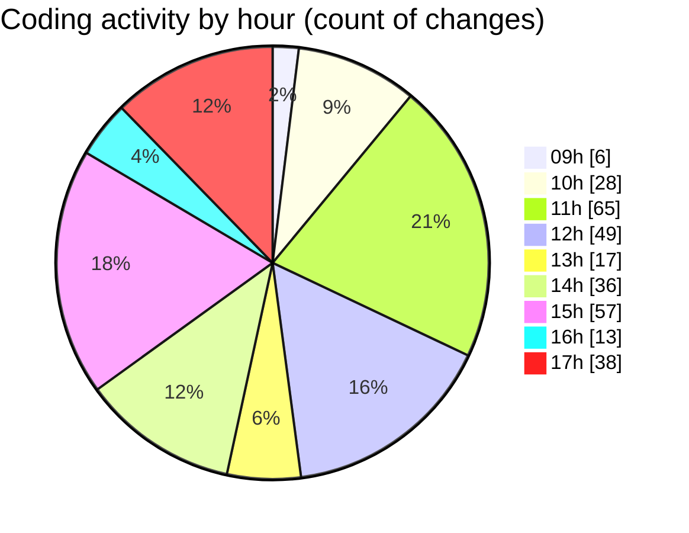

# cda - Activity Summary 

## Overall Statistics

| Stat                   | Value                                                             |
| ---------------------- | ----------------------------------------------------------------- |
| **Lines Added** (➕)   | 1623                                          |
| **Lines Removed** (➖) | 619                                        |
| **Net Change** (↕)    | 1004                |
| **Active Time** (⌚)   | 437 minutes |

## Modified Files
- **RequestEditModal.tsx** (+444, -229)
- **RequestEditModal.scss** (+520, -328)
- **RequestEditModal.test.tsx** (+109, -27)
- **Home.tsx** (+117, -20)
- **Home.scss** (+67, -0)
- **RequestCard.tsx** (+136, -0)
- **types.ts** (+40, -0)
- **RequestWrapper.tsx** (+43, -2)
- **RequestForm.test.tsx** (+99, -8)
- **RequestCard.test.tsx** (+48, -5)

## Visualizations

### By File Type (Lines Changed)

### By Hour (Estimated Activity Count)

> **Last Updated:** 27/03/2025, 17:32:22