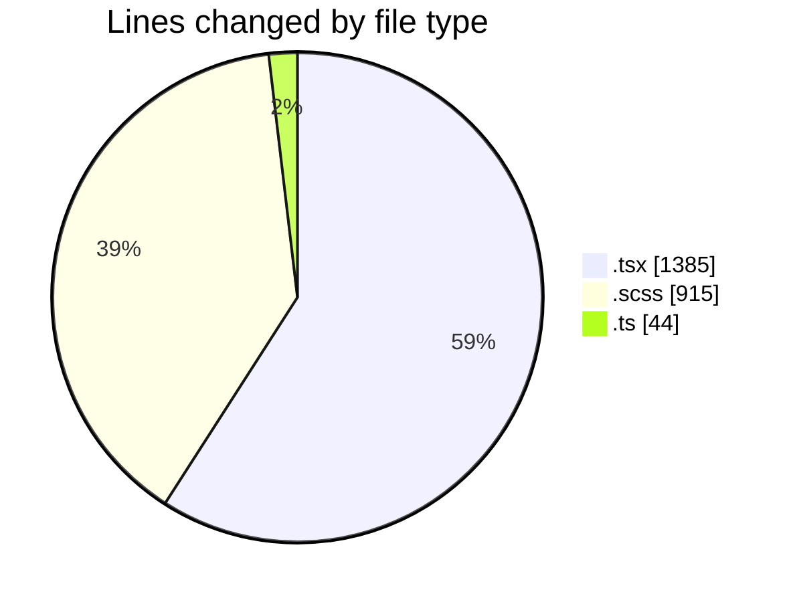
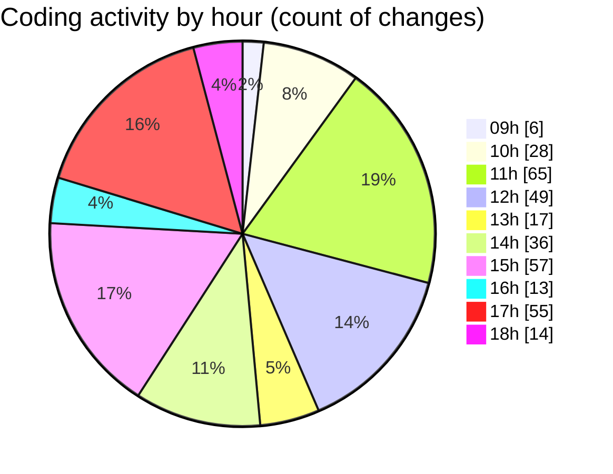

# cda - Activity Summary 

## Overall Statistics

| Stat                   | Value                                                             |
| ---------------------- | ----------------------------------------------------------------- |
| **Lines Added** (➕)   | 1675                                          |
| **Lines Removed** (➖) | 669                                        |
| **Net Change** (↕)    | 1006                |
| **Active Time** (⌚)   | 491 minutes |

## Modified Files
- **RequestEditModal.tsx** (+458, -241)
- **RequestEditModal.scss** (+520, -328)
- **RequestEditModal.test.tsx** (+109, -27)
- **Home.tsx** (+131, -38)
- **Home.scss** (+67, -0)
- **RequestCard.tsx** (+158, -18)
- **types.ts** (+42, -2)
- **RequestWrapper.tsx** (+43, -2)
- **RequestForm.test.tsx** (+99, -8)
- **RequestCard.test.tsx** (+48, -5)

## Visualizations

### By File Type (Lines Changed)

### By Hour (Estimated Activity Count)

> **Last Updated:** 27/03/2025, 18:27:22