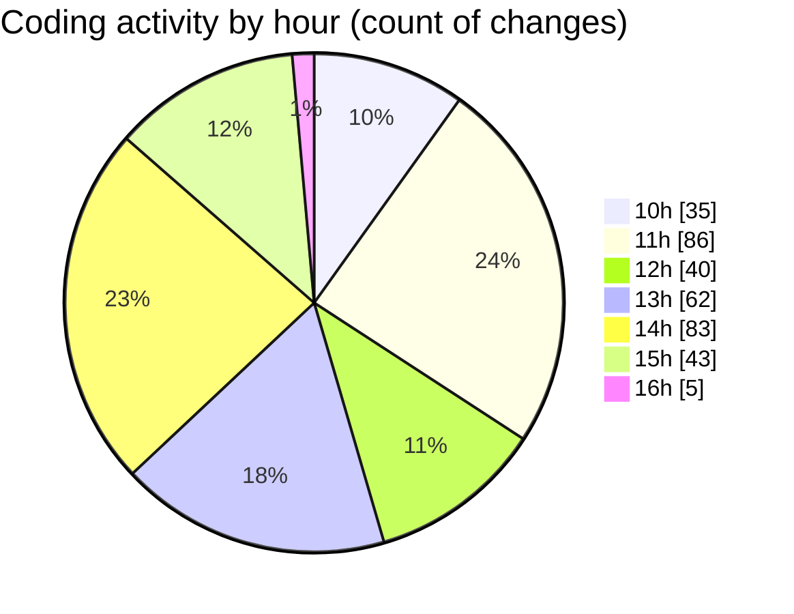

# cda - Activity Summary 

## Overall Statistics

| Stat                   | Value                                                             |
| ---------------------- | ----------------------------------------------------------------- |
| **Lines Added** (➕)   | 6940                                          |
| **Lines Removed** (➖) | 1090                                        |
| **Net Change** (↕)    | 5850                |
| **Active Time** (⌚)   | 475 minutes |

## Modified Files
- **UserView.scss** (+438, -430)
- **RequestView.scss** (+39, -0)
- **UserView.tsx** (+573, -386)
- **RequestView.tsx** (+185, -0)
- ** request.ts** (+57, -0)
- **App.scss** (+190, -44)
- **request.ts** (+96, -0)
- **UserView.test.tsx** (+345, -220)
- **App.tsx** (+58, -0)
- **RequestForm.test.tsx** (+101, -8)
- **graphql.ts** (+4710, -0)
- **RequestForm.tsx** (+148, -2)

## Visualizations

### By File Type (Lines Changed)

### By Hour (Estimated Activity Count)

> **Last Updated:** 28/03/2025, 16:10:30