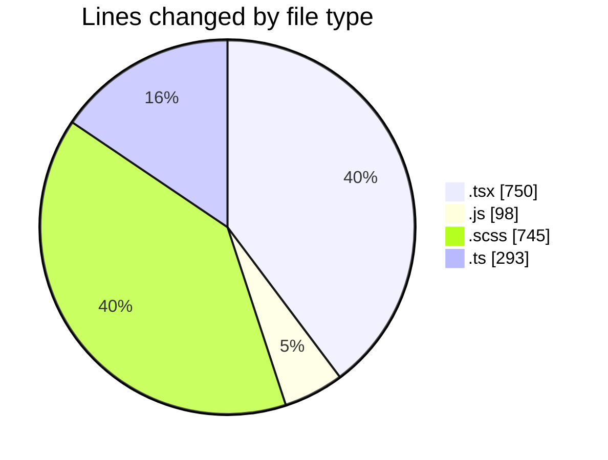
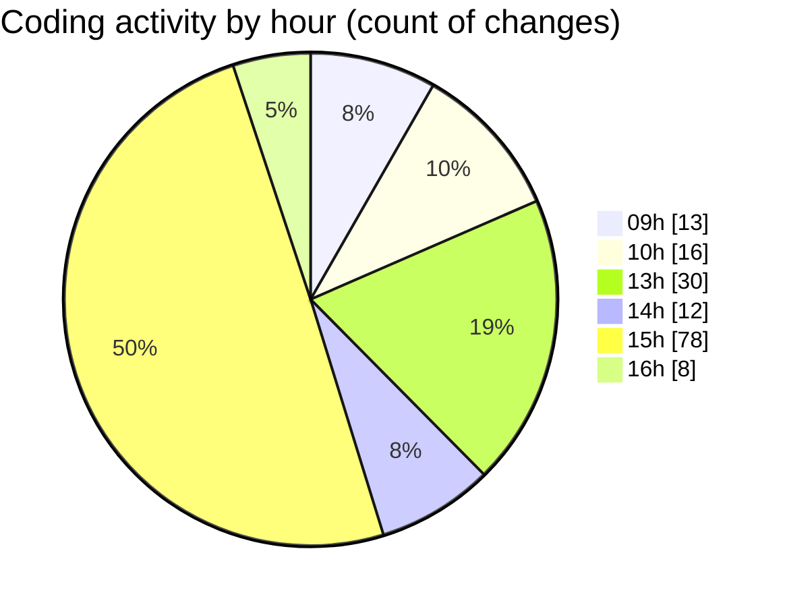

# cda - Activity Summary 

## Overall Statistics

| Stat                   | Value                                                             |
| ---------------------- | ----------------------------------------------------------------- |
| **Lines Added** (➕)   | 1512                                          |
| **Lines Removed** (➖) | 374                                        |
| **Net Change** (↕)    | 1138                |
| **Active Time** (⌚)   | 202 minutes |

## Modified Files
- **UserView.test.tsx** (+125, -0)
- **duty-request.js** (+98, -0)
- **App.tsx** (+67, -6)
- **NewRequest.tsx** (+25, -4)
- **RequestForm.tsx** (+196, -26)
- **RequestForm.scss** (+259, -90)
- **UserView.tsx** (+203, -7)
- **App.scss** (+207, -175)
- **UserView.scss** (+13, -1)
- **request.test.ts** (+228, -65)
- **RequestForm.test.tsx** (+91, -0)

## Visualizations

### By File Type (Lines Changed)

### By Hour (Estimated Activity Count)

> **Last Updated:** 31/03/2025, 16:07:47