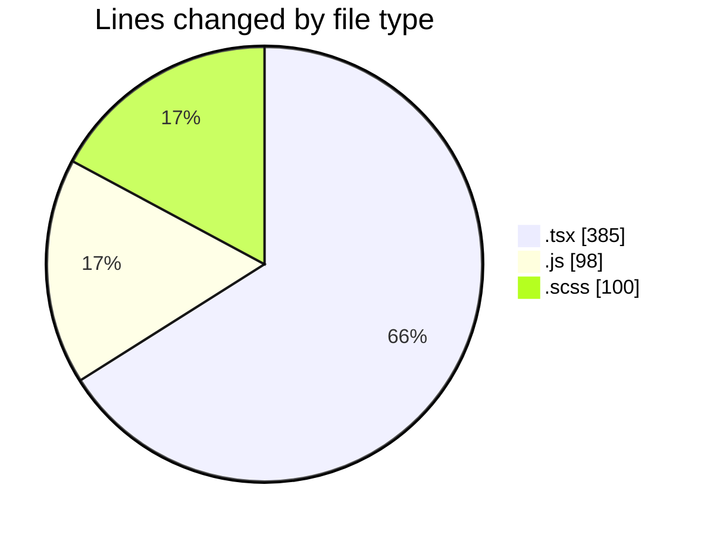
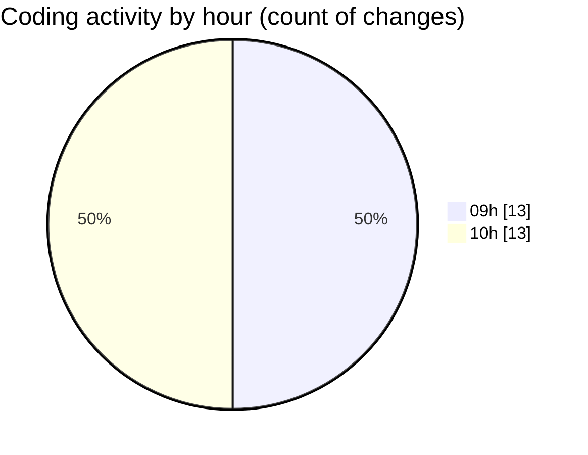

# cda - Activity Summary 

## Overall Statistics

| Stat                   | Value                                                             |
| ---------------------- | ----------------------------------------------------------------- |
| **Lines Added** (➕)   | 576                                          |
| **Lines Removed** (➖) | 7                                        |
| **Net Change** (↕)    | 569                |
| **Active Time** (⌚)   | 36 minutes |

## Modified Files
- **UserView.test.tsx** (+125, -0)
- **duty-request.js** (+98, -0)
- **App.tsx** (+61, -0)
- **NewRequest.tsx** (+23, -2)
- **RequestForm.tsx** (+172, -2)
- **RequestForm.scss** (+97, -3)

## Visualizations

### By File Type (Lines Changed)

### By Hour (Estimated Activity Count)

> **Last Updated:** 31/03/2025, 10:07:47