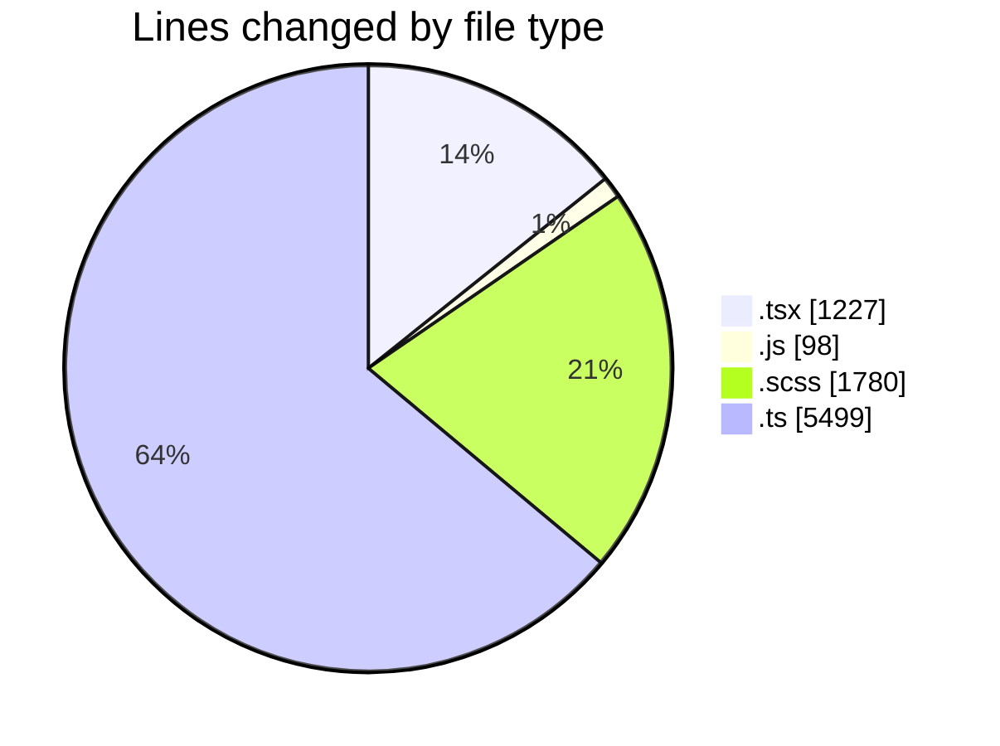
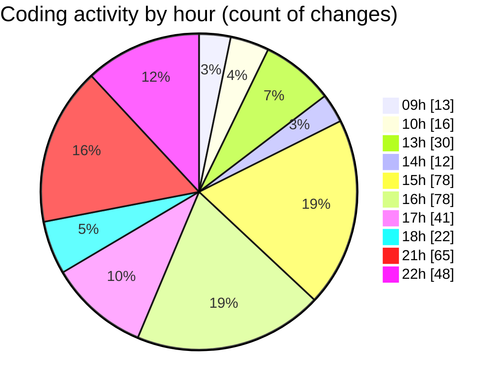

# cda - Activity Summary 

## Overall Statistics

| Stat                   | Value                                                             |
| ---------------------- | ----------------------------------------------------------------- |
| **Lines Added** (➕)   | 7344                                          |
| **Lines Removed** (➖) | 1260                                        |
| **Net Change** (↕)    | 6084                |
| **Active Time** (⌚)   | 478 minutes |

## Modified Files
- **UserView.test.tsx** (+125, -0)
- **duty-request.js** (+98, -0)
- **App.tsx** (+70, -9)
- **NewRequest.tsx** (+27, -6)
- **RequestForm.tsx** (+378, -175)
- **RequestForm.scss** (+688, -450)
- **UserView.tsx** (+203, -7)
- **App.scss** (+330, -298)
- **UserView.scss** (+13, -1)
- **request.test.ts** (+228, -65)
- **RequestForm.test.tsx** (+104, -13)
- **queries.ts** (+292, -236)
- **index.ts** (+3, -0)
- **gql.ts** (+62, -0)
- **RequestView.test.tsx** (+67, -0)
- **Home.tsx** (+43, -0)
- **mutations.ts** (+82, -0)
- **graphql.ts** (+4431, -0)
- **queries.ts** (+68, -0)
- **types.ts** (+32, -0)

## Visualizations

### By File Type (Lines Changed)

### By Hour (Estimated Activity Count)

> **Last Updated:** 31/03/2025, 22:50:55