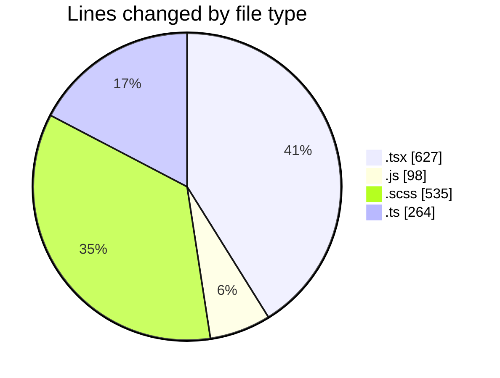
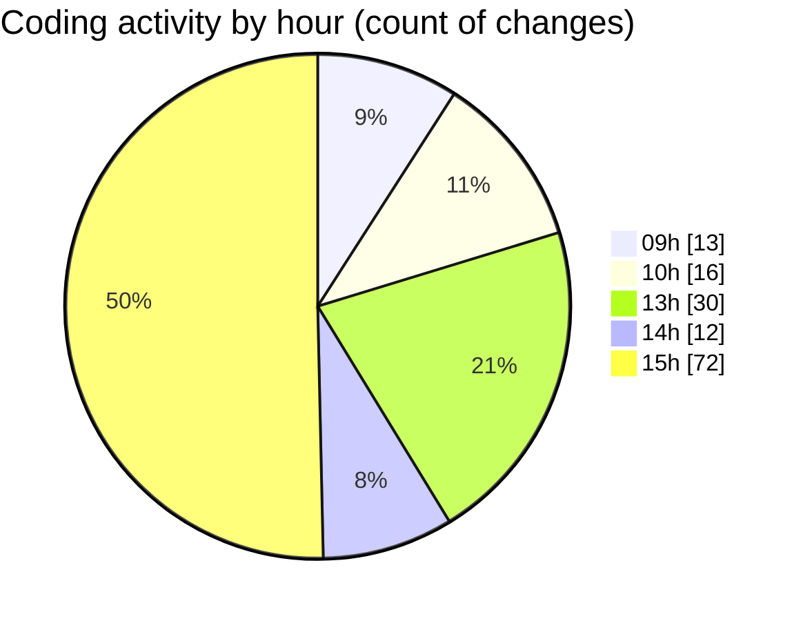

# cda - Activity Summary 

## Overall Statistics

| Stat                   | Value                                                             |
| ---------------------- | ----------------------------------------------------------------- |
| **Lines Added** (➕)   | 1305                                          |
| **Lines Removed** (➖) | 219                                        |
| **Net Change** (↕)    | 1086                |
| **Active Time** (⌚)   | 187 minutes |

## Modified Files
- **UserView.test.tsx** (+125, -0)
- **duty-request.js** (+98, -0)
- **App.tsx** (+64, -3)
- **NewRequest.tsx** (+25, -2)
- **RequestForm.tsx** (+172, -26)
- **RequestForm.scss** (+172, -90)
- **UserView.tsx** (+203, -7)
- **App.scss** (+207, -52)
- **UserView.scss** (+13, -1)
- **request.test.ts** (+226, -38)

## Visualizations

### By File Type (Lines Changed)

### By Hour (Estimated Activity Count)

> **Last Updated:** 31/03/2025, 15:52:47