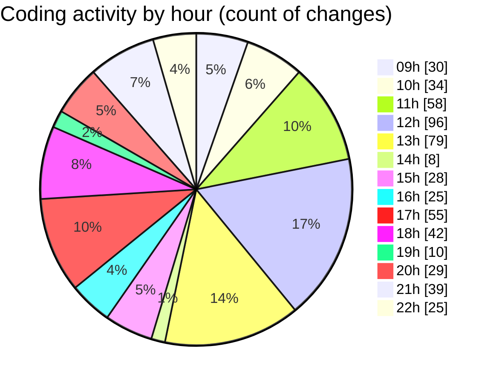

# cda - Activity Summary 

## Overall Statistics

| Stat                   | Value                                                             |
| ---------------------- | ----------------------------------------------------------------- |
| **Lines Added** (➕)   | 3974                                          |
| **Lines Removed** (➖) | 1639                                        |
| **Net Change** (↕)    | 2335                |
| **Active Time** (⌚)   | 741 minutes |

## Modified Files
- **TimePickerList.tsx** (+169, -34)
- **TimePicker.tsx** (+966, -394)
- **timePreset.ts** (+17, -0)
- **RequestForm.tsx** (+530, -75)
- **types.ts** (+42, -4)
- **TimePicker.scss** (+832, -661)
- **RequestForm.scss** (+437, -10)
- **RequestForm.test.tsx** (+600, -363)
- **TimePicker.test.tsx** (+261, -97)
- **index.tsx** (+3, -0)
- **App.tsx** (+117, -1)

## Visualizations

### By File Type (Lines Changed)

### By Hour (Estimated Activity Count)

> **Last Updated:** 02/04/2025, 22:53:56