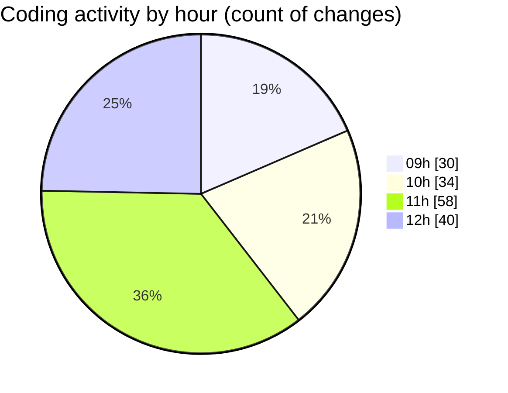

# cda - Activity Summary 

## Overall Statistics

| Stat                   | Value                                                             |
| ---------------------- | ----------------------------------------------------------------- |
| **Lines Added** (➕)   | 1230                                          |
| **Lines Removed** (➖) | 166                                        |
| **Net Change** (↕)    | 1064                |
| **Active Time** (⌚)   | 221 minutes |

## Modified Files
- **TimePickerList.tsx** (+60, -10)
- **TimePicker.tsx** (+374, -59)
- **timePreset.ts** (+17, -0)
- **RequestForm.tsx** (+239, -21)
- **types.ts** (+42, -4)
- **TimePicker.scss** (+288, -72)
- **RequestForm.scss** (+210, -0)

## Visualizations

### By File Type (Lines Changed)

### By Hour (Estimated Activity Count)

> **Last Updated:** 02/04/2025, 12:15:59