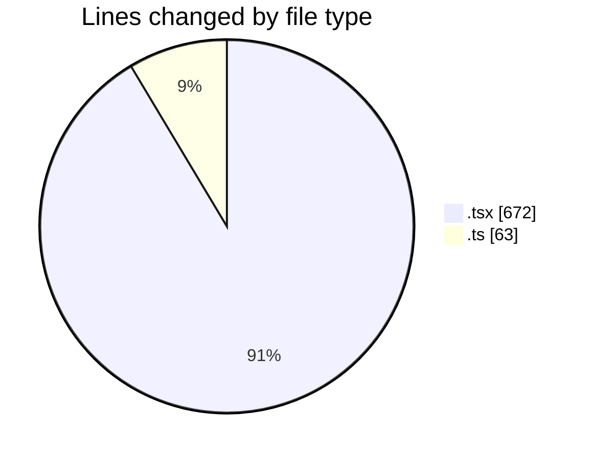
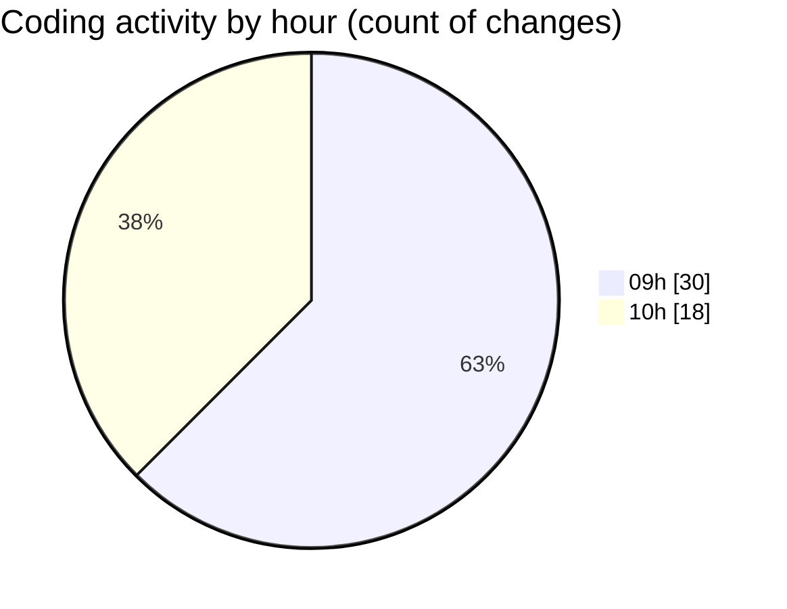

# cda - Activity Summary 

## Overall Statistics

| Stat                   | Value                                                             |
| ---------------------- | ----------------------------------------------------------------- |
| **Lines Added** (➕)   | 677                                          |
| **Lines Removed** (➖) | 58                                        |
| **Net Change** (↕)    | 619                |
| **Active Time** (⌚)   | 71 minutes |

## Modified Files
- **TimePickerList.tsx** (+60, -10)
- **TimePicker.tsx** (+319, -31)
- **timePreset.ts** (+17, -0)
- **RequestForm.tsx** (+239, -13)
- **types.ts** (+42, -4)

## Visualizations

### By File Type (Lines Changed)

### By Hour (Estimated Activity Count)

> **Last Updated:** 02/04/2025, 10:40:59