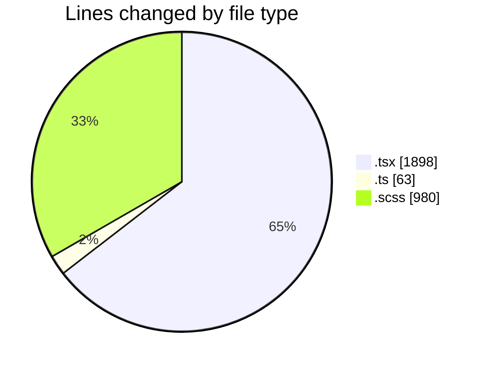
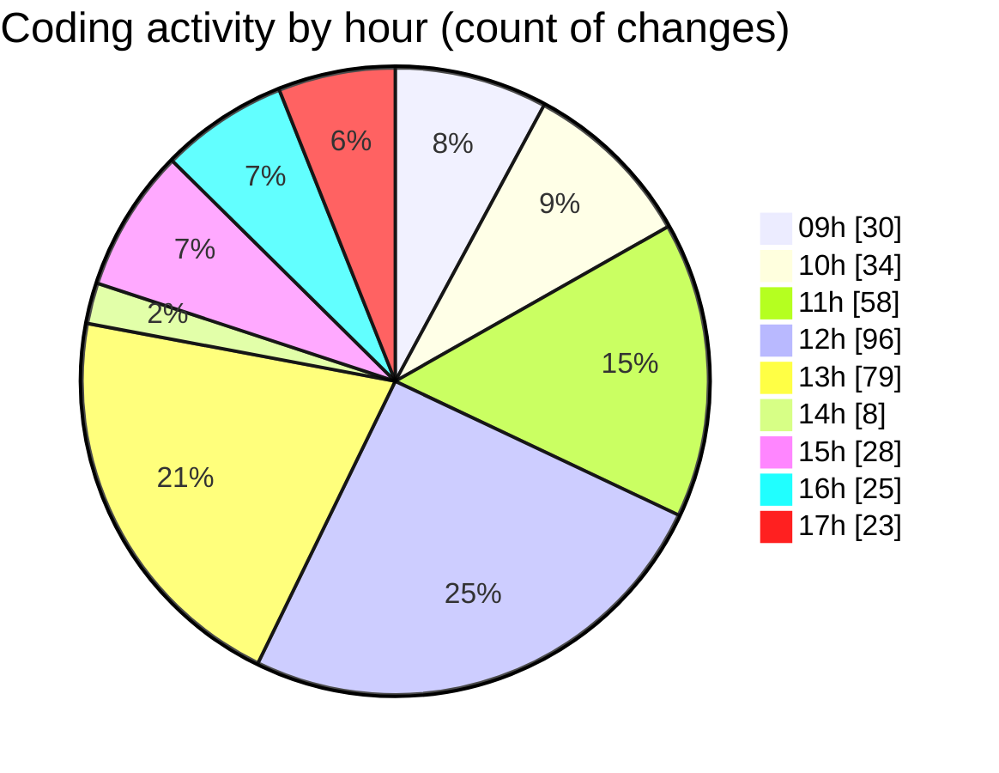

# cda - Activity Summary 

## Overall Statistics

| Stat                   | Value                                                             |
| ---------------------- | ----------------------------------------------------------------- |
| **Lines Added** (➕)   | 2132                                          |
| **Lines Removed** (➖) | 809                                        |
| **Net Change** (↕)    | 1323                |
| **Active Time** (⌚)   | 501 minutes |

## Modified Files
- **TimePickerList.tsx** (+60, -10)
- **TimePicker.tsx** (+380, -90)
- **timePreset.ts** (+17, -0)
- **RequestForm.tsx** (+242, -33)
- **types.ts** (+42, -4)
- **TimePicker.scss** (+461, -304)
- **RequestForm.scss** (+213, -2)
- **RequestForm.test.tsx** (+600, -363)
- **TimePicker.test.tsx** (+55, -2)
- **index.tsx** (+3, -0)
- **App.tsx** (+59, -1)

## Visualizations

### By File Type (Lines Changed)

### By Hour (Estimated Activity Count)

> **Last Updated:** 02/04/2025, 17:30:59