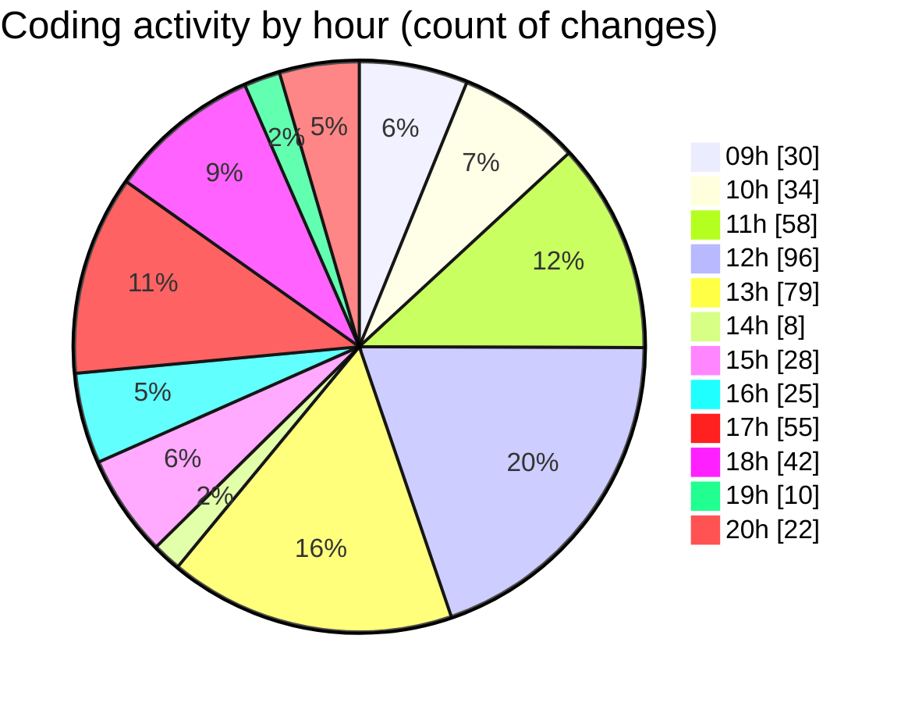

# cda - Activity Summary 

## Overall Statistics

| Stat                   | Value                                                             |
| ---------------------- | ----------------------------------------------------------------- |
| **Lines Added** (➕)   | 2909                                          |
| **Lines Removed** (➖) | 1486                                        |
| **Net Change** (↕)    | 1423                |
| **Active Time** (⌚)   | 638 minutes |

## Modified Files
- **TimePickerList.tsx** (+169, -34)
- **TimePicker.tsx** (+674, -385)
- **timePreset.ts** (+17, -0)
- **RequestForm.tsx** (+245, -33)
- **types.ts** (+42, -4)
- **TimePicker.scss** (+832, -661)
- **RequestForm.scss** (+213, -3)
- **RequestForm.test.tsx** (+600, -363)
- **TimePicker.test.tsx** (+55, -2)
- **index.tsx** (+3, -0)
- **App.tsx** (+59, -1)

## Visualizations

### By File Type (Lines Changed)

### By Hour (Estimated Activity Count)

> **Last Updated:** 02/04/2025, 20:50:59