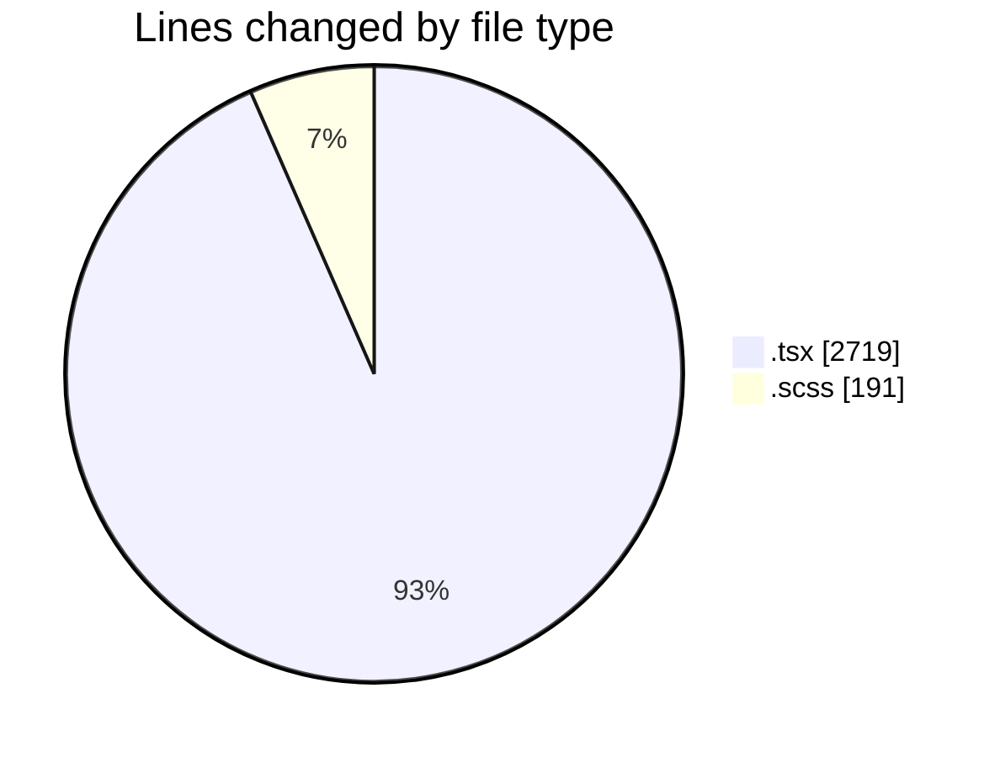
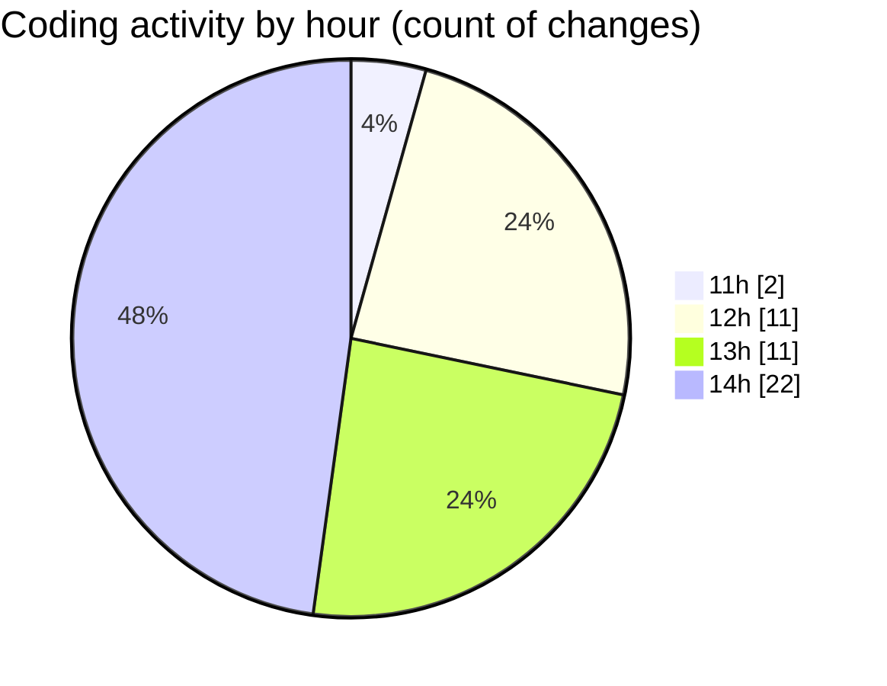

# cda - Activity Summary 

## Overall Statistics

| Stat                   | Value                                                             |
| ---------------------- | ----------------------------------------------------------------- |
| **Lines Added** (➕)   | 2843                                          |
| **Lines Removed** (➖) | 67                                        |
| **Net Change** (↕)    | 2776                |
| **Active Time** (⌚)   | 70 minutes |

## Modified Files
- **App.tsx** (+500, -0)
- **PositionTable.tsx** (+167, -0)
- **PoolsTable.tsx** (+158, -21)
- **CommonTable.tsx** (+126, -3)
- **PoolPositionAmountsPanel.tsx** (+196, -0)
- **PoolDetails.tsx** (+390, -1)
- **PoolPosition.tsx** (+606, -0)
- **NewRequest.tsx** (+13, -0)
- **RequestForm.tsx** (+219, -5)
- **TimePicker.tsx** (+289, -25)
- **TimePicker.scss** (+179, -12)

## Visualizations

### By File Type (Lines Changed)

### By Hour (Estimated Activity Count)

> **Last Updated:** 04/04/2025, 14:33:23