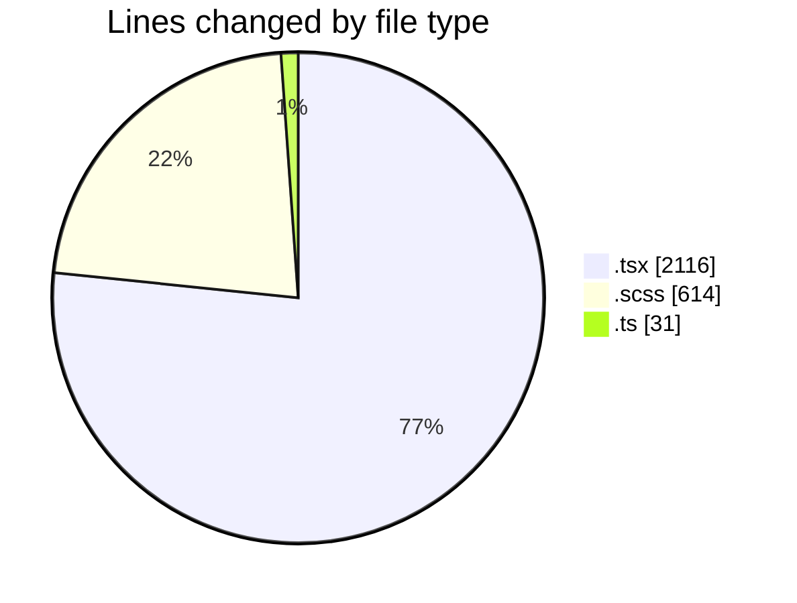
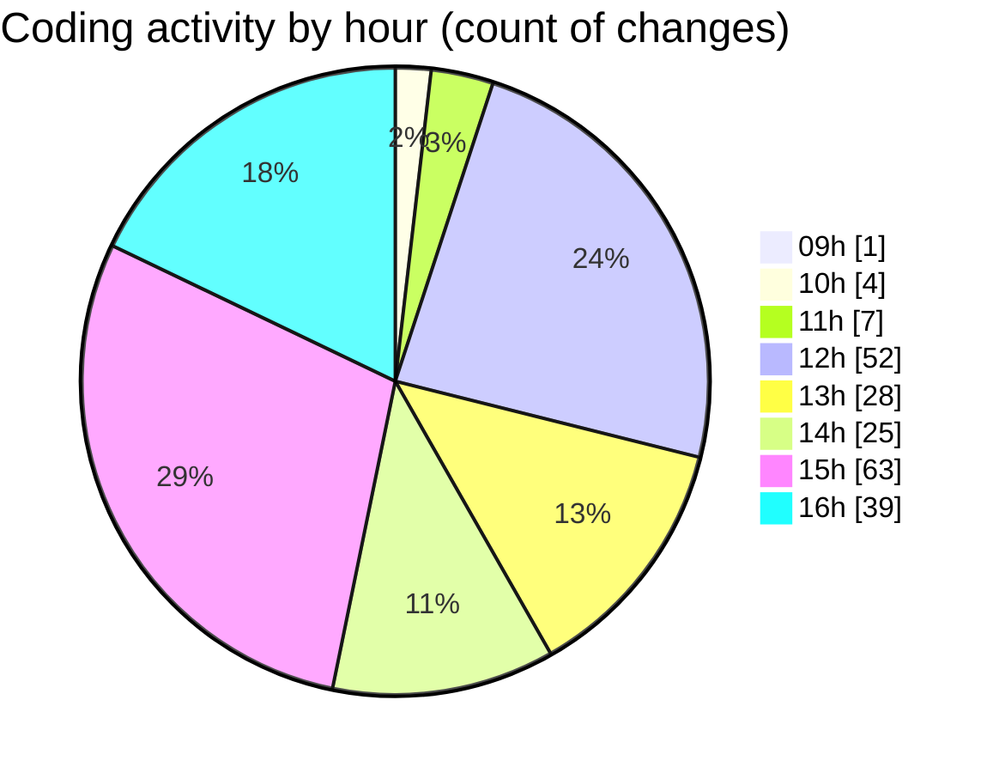

# cda - Activity Summary 

## Overall Statistics

| Stat                   | Value                                                             |
| ---------------------- | ----------------------------------------------------------------- |
| **Lines Added** (➕)   | 2367                                          |
| **Lines Removed** (➖) | 394                                        |
| **Net Change** (↕)    | 1973                |
| **Active Time** (⌚)   | 330 minutes |

## Modified Files
- **RequestForm.test.tsx** (+163, -0)
- **RequestForm.tsx** (+215, -0)
- **App.tsx** (+505, -5)
- **InitiativeDetails.tsx** (+641, -58)
- **InitiativeDetails.scss** (+255, -176)
- **DetailsGrid.tsx** (+92, -45)
- **DetailsField.tsx** (+260, -68)
- **DetailsGrid.scss** (+146, -37)
- **HelperContent.ts** (+28, -0)
- **HelperContent.tsx** (+59, -5)
- **index.ts** (+3, -0)

## Visualizations

### By File Type (Lines Changed)

### By Hour (Estimated Activity Count)

> **Last Updated:** 07/04/2025, 16:35:58