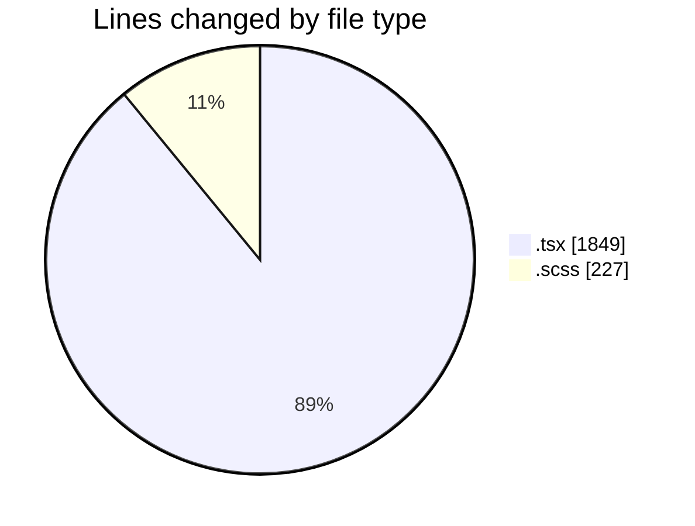
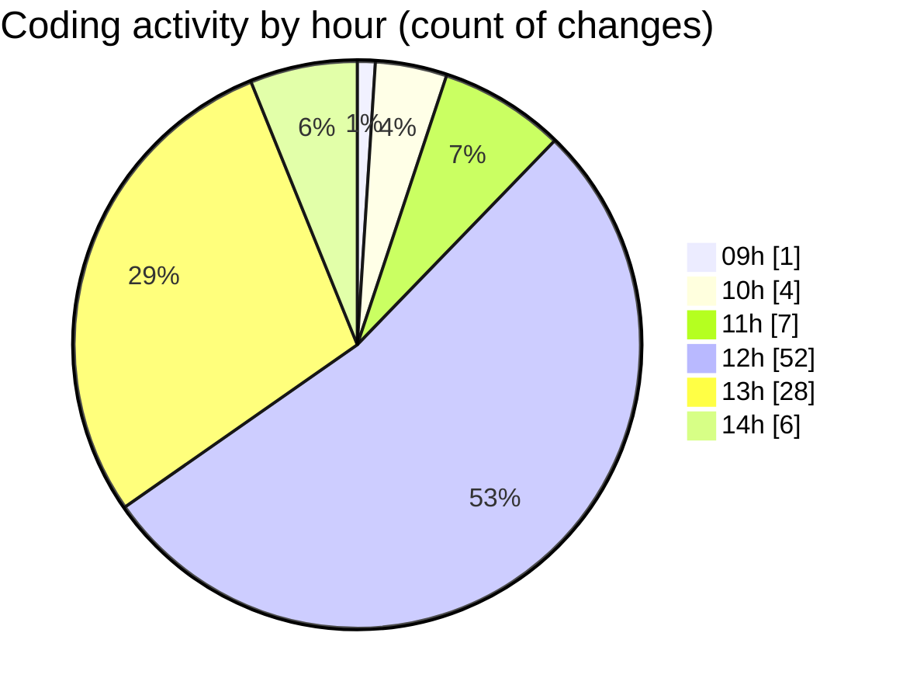

# cda - Activity Summary 

## Overall Statistics

| Stat                   | Value                                                             |
| ---------------------- | ----------------------------------------------------------------- |
| **Lines Added** (➕)   | 1937                                          |
| **Lines Removed** (➖) | 139                                        |
| **Net Change** (↕)    | 1798                |
| **Active Time** (⌚)   | 137 minutes |

## Modified Files
- **RequestForm.test.tsx** (+163, -0)
- **RequestForm.tsx** (+215, -0)
- **App.tsx** (+504, -4)
- **InitiativeDetails.tsx** (+582, -1)
- **InitiativeDetails.scss** (+168, -59)
- **DetailsGrid.tsx** (+92, -45)
- **DetailsField.tsx** (+213, -30)

## Visualizations

### By File Type (Lines Changed)

### By Hour (Estimated Activity Count)

> **Last Updated:** 07/04/2025, 14:20:58