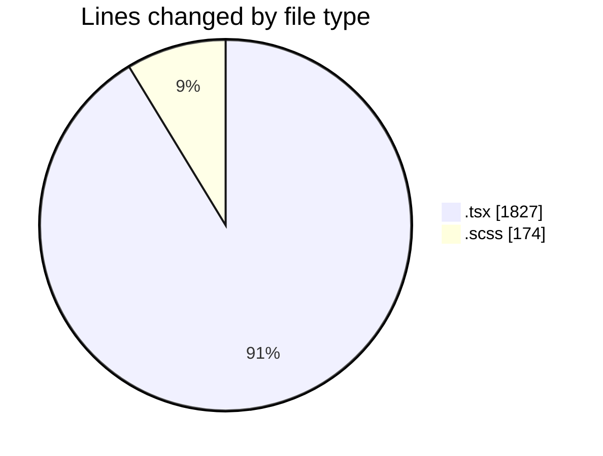
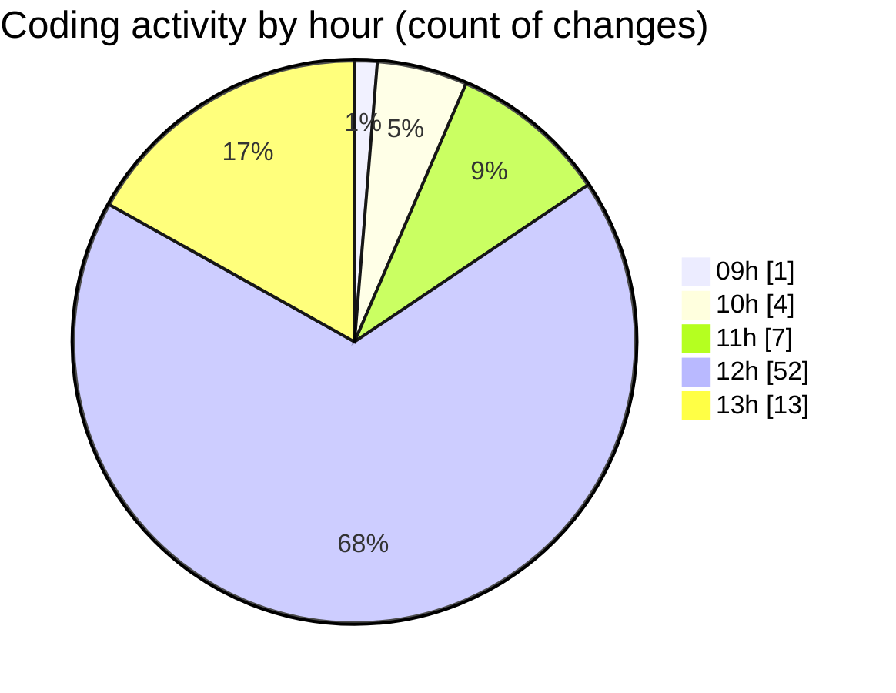

# cda - Activity Summary 

## Overall Statistics

| Stat                   | Value                                                             |
| ---------------------- | ----------------------------------------------------------------- |
| **Lines Added** (➕)   | 1895                                          |
| **Lines Removed** (➖) | 106                                        |
| **Net Change** (↕)    | 1789                |
| **Active Time** (⌚)   | 106 minutes |

## Modified Files
- **RequestForm.test.tsx** (+163, -0)
- **RequestForm.tsx** (+215, -0)
- **App.tsx** (+504, -4)
- **InitiativeDetails.tsx** (+582, -1)
- **InitiativeDetails.scss** (+134, -40)
- **DetailsGrid.tsx** (+92, -45)
- **DetailsField.tsx** (+205, -16)

## Visualizations

### By File Type (Lines Changed)

### By Hour (Estimated Activity Count)

> **Last Updated:** 07/04/2025, 13:30:58