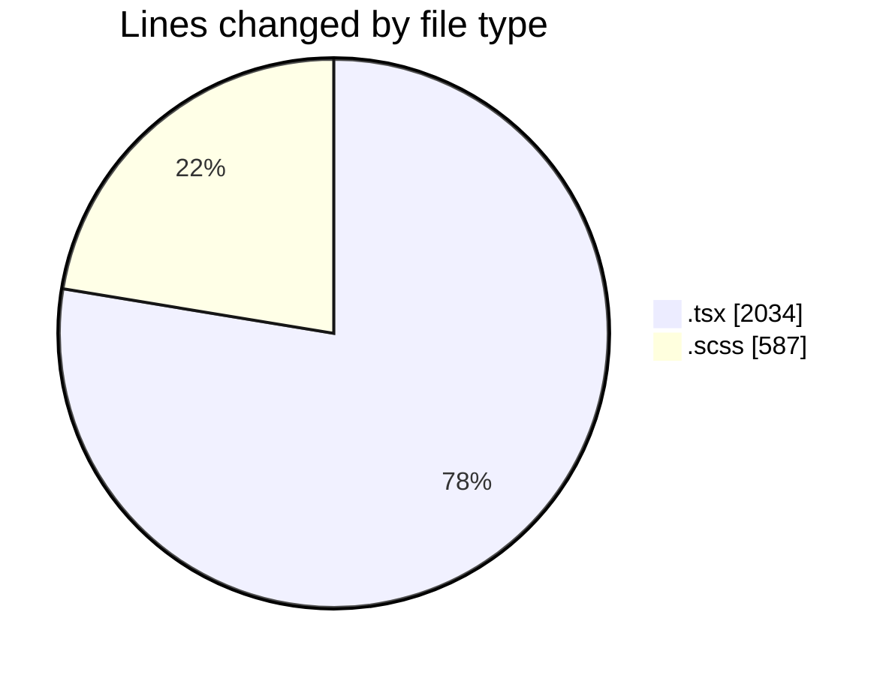
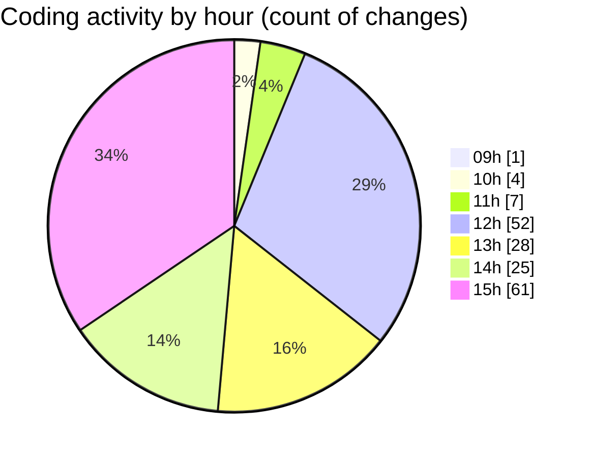

# cda - Activity Summary 

## Overall Statistics

| Stat                   | Value                                                             |
| ---------------------- | ----------------------------------------------------------------- |
| **Lines Added** (➕)   | 2253                                          |
| **Lines Removed** (➖) | 368                                        |
| **Net Change** (↕)    | 1885                |
| **Active Time** (⌚)   | 268 minutes |

## Modified Files
- **RequestForm.test.tsx** (+163, -0)
- **RequestForm.tsx** (+215, -0)
- **App.tsx** (+505, -5)
- **InitiativeDetails.tsx** (+640, -50)
- **InitiativeDetails.scss** (+255, -176)
- **DetailsGrid.tsx** (+92, -45)
- **DetailsField.tsx** (+256, -63)
- **DetailsGrid.scss** (+127, -29)

## Visualizations

### By File Type (Lines Changed)

### By Hour (Estimated Activity Count)

> **Last Updated:** 07/04/2025, 15:55:58