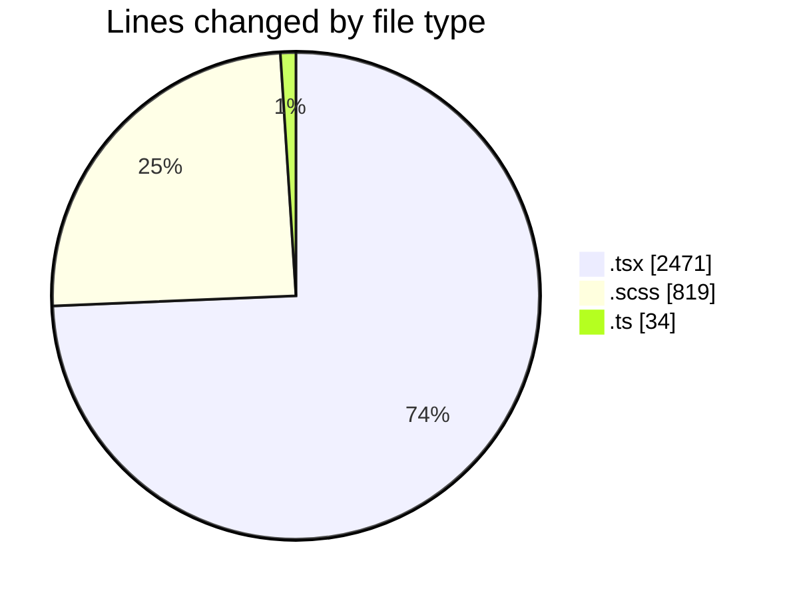
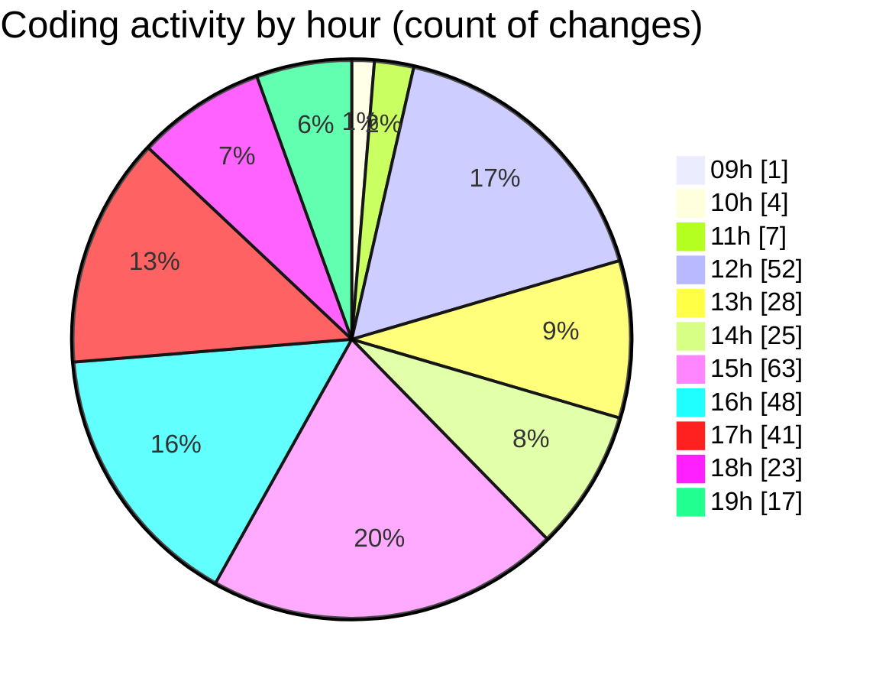

# cda - Activity Summary 

## Overall Statistics

| Stat                   | Value                                                             |
| ---------------------- | ----------------------------------------------------------------- |
| **Lines Added** (➕)   | 2816                                          |
| **Lines Removed** (➖) | 508                                        |
| **Net Change** (↕)    | 2308                |
| **Active Time** (⌚)   | 469 minutes |

## Modified Files
- **RequestForm.test.tsx** (+163, -0)
- **RequestForm.tsx** (+215, -0)
- **App.tsx** (+505, -5)
- **InitiativeDetails.tsx** (+642, -59)
- **InitiativeDetails.scss** (+255, -176)
- **DetailsGrid.tsx** (+92, -45)
- **DetailsField.tsx** (+274, -105)
- **DetailsGrid.scss** (+164, -56)
- **HelperContent.ts** (+28, -0)
- **HelperContent.tsx** (+126, -16)
- **index.ts** (+3, -0)
- **Panel.tsx** (+72, -39)
- **App.scss** (+164, -4)
- **index.ts** (+3, -0)
- **HelperModal.tsx** (+110, -3)

## Visualizations

### By File Type (Lines Changed)

### By Hour (Estimated Activity Count)

> **Last Updated:** 07/04/2025, 19:20:58