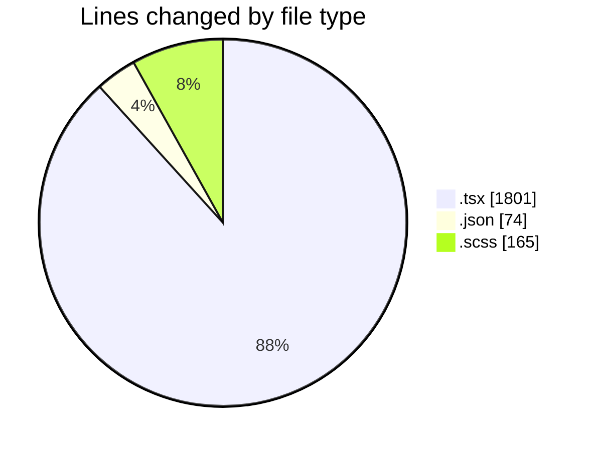
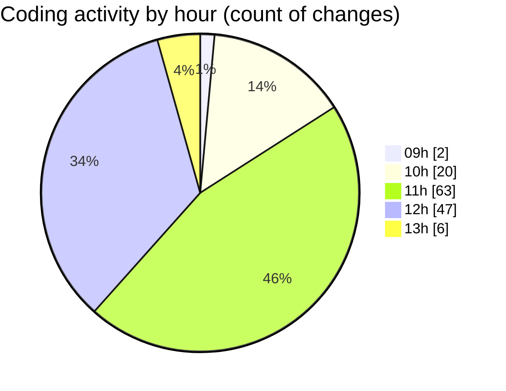

# cda - Activity Summary 

## Overall Statistics

| Stat                   | Value                                                             |
| ---------------------- | ----------------------------------------------------------------- |
| **Lines Added** (➕)   | 1818                                          |
| **Lines Removed** (➖) | 222                                        |
| **Net Change** (↕)    | 1596                |
| **Active Time** (⌚)   | 198 minutes |

## Modified Files
- **HelperModal.tsx** (+826, -222)
- **settings.json** (+74, -0)
- **InitiativeDetails.tsx** (+583, -0)
- **App.scss** (+165, -0)
- **DetailsField.tsx** (+170, -0)

## Visualizations

### By File Type (Lines Changed)

### By Hour (Estimated Activity Count)

> **Last Updated:** 08/04/2025, 13:15:12