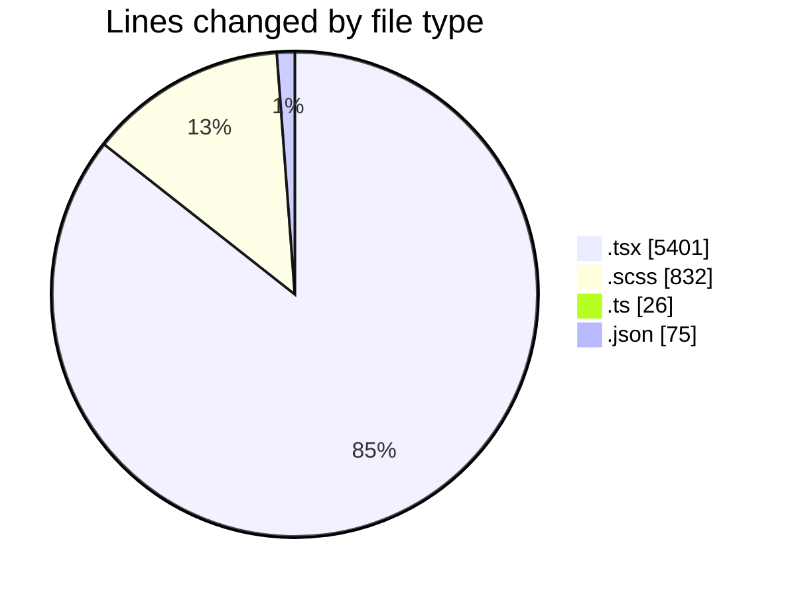
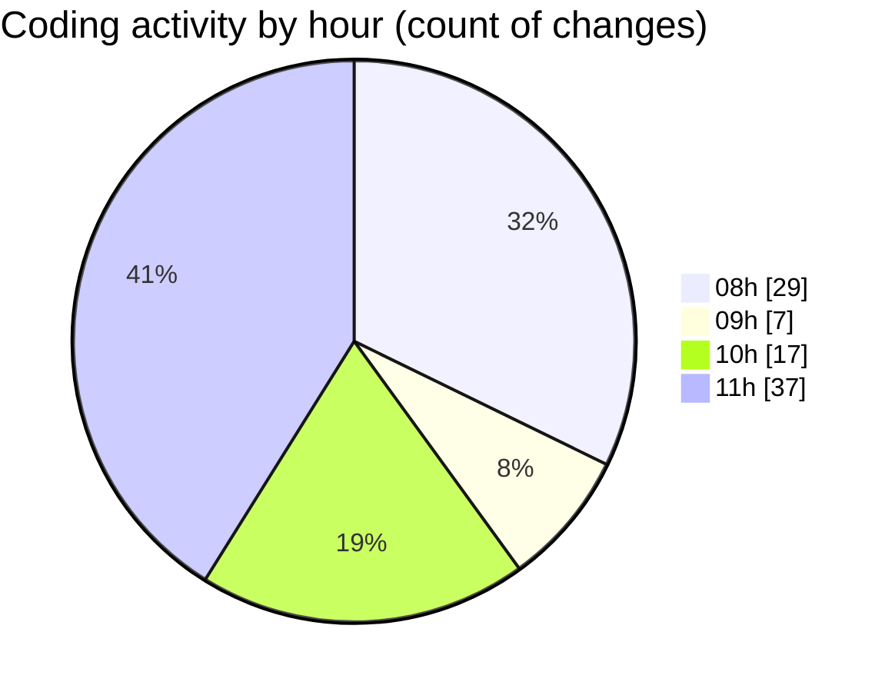

# cda - Activity Summary 

## Overall Statistics

| Stat                   | Value                                                             |
| ---------------------- | ----------------------------------------------------------------- |
| **Lines Added** (➕)   | 5952                                          |
| **Lines Removed** (➖) | 382                                        |
| **Net Change** (↕)    | 5570                |
| **Active Time** (⌚)   | 127 minutes |

## Modified Files
- **HelperModal.tsx** (+555, -6)
- **App.scss** (+514, -189)
- **DetailsField.tsx** (+189, -13)
- **types.d.ts** (+17, -9)
- **settings.json** (+75, -0)
- **App.tsx** (+503, -3)
- **PoolPositionAmountsPanel.tsx** (+208, -6)
- **Panel.tsx** (+42, -9)
- **CostDetails.scss** (+25, -2)
- **PoolDetails.scss** (+36, -2)
- **PoolEvent.scss** (+63, -1)
- **PoolPosition.tsx** (+606, -56)
- **PoolPositions.tsx** (+933, -86)
- **PoolDetails.tsx** (+394, -0)
- **CostDetails.tsx** (+289, -0)
- **CostActuals.tsx** (+122, -0)
- **ReinvestmentDetail.tsx** (+525, -0)
- **InitiativeDetails.tsx** (+652, -0)
- **PoolEvent.tsx** (+129, -0)
- **PoolEvents.tsx** (+75, -0)

## Visualizations

### By File Type (Lines Changed)

### By Hour (Estimated Activity Count)

> **Last Updated:** 09/04/2025, 11:55:06